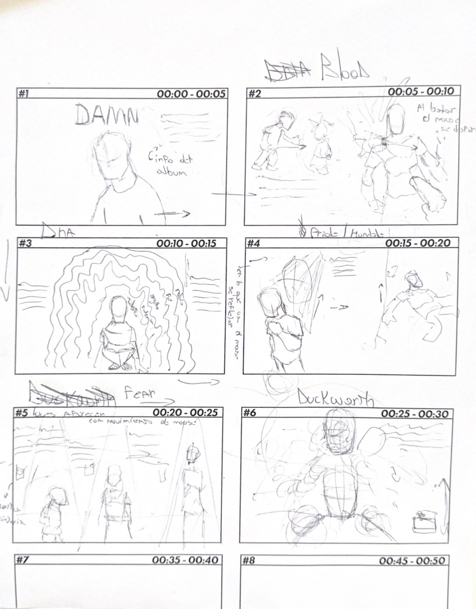
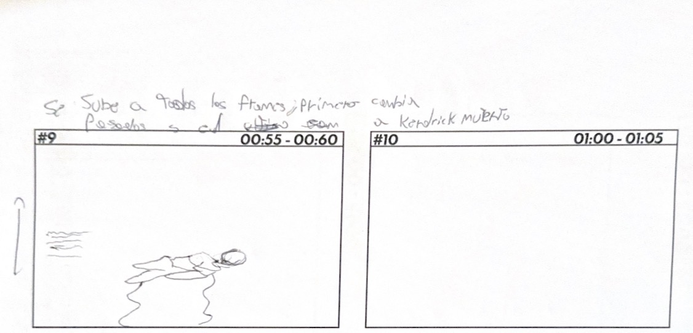

# EXAMEN-DAMN-Godoy-Bastidas


## Link de web pública (github pages)

<https://pavloskyyy.github.io/Sketch-interactivo-Godoy-Bastidas/>

### DAMN.


### Referencia de origen / bibliografía

Album del rapero kendrick lamar que habla sobre la lucha, los problemas y la duadlidad

### Imagen de referencia de proyecto

Deja acá una imagen de la "portada" de tu proyecto. Como si fuera un afiche. Puede ser un fotograma de toda la interacción.

### Integrantes

Estudiante A [pavloskyyy](https://github.com/pavloskyyy)

Estudiante B [agustinbastidas-pro](https://github.com/agustinbastidas-pro)


### Enlace de p5.js 

<https://editor.p5js.org/agustinbastidas0107/sketches/cHQGYu75z>

### Relato inicial

DAMN. es un viaje emocional por la mente de Kendrick Lamar, donde aparecen temas como culpa, fe, miedo, orgullo, violencia y destino. La historia comienza con BLOOD, cuando Kendrick intenta ayudar a una mujer ciega, pero ella le dispara. Desde ese momento, el álbum se presenta como una caída marcada por la fragilidad de la vida.

En DNA, Kendrick habla de su identidad, su herencia, su rabia y el peso de venir de una historia familiar y social compleja. Luego, en PRIDE y HUMBLE, aparece la lucha entre el ego y la humildad, mostrando a Kendrick enfrentándose a sus propias contradicciones.

En FEAR, el miedo se muestra en distintas etapas: la infancia, la juventud y el presente. El miedo cambia de forma, pero siempre está presente en su vida. Finalmente, DUCKWORTH revela el origen de todo: un encuentro entre su padre y Top Dawg que pudo terminar en violencia, pero no lo hizo. Gracias a esa decisión, Kendrick existe.

Al escuchar DAMN. al revés, el relato cambia: ya no parte con una muerte, sino con el azar que permitió su vida. Por eso el álbum se entiende como una historia circular entre destino, violencia y salvación.

### Storyboard





#### Estados

En el primer estado, aparece el vinilo de la portada del album junto con una version alternativa
en el segundo estado, aparece kendrick ayudando a una abuela, terminando con la traicion de esta misma (BLOOD)
al hacer la combinacion de teclas sigues avanzando por los distintos estados
en el tercer estado aparece kendrick derrotado por sus decisiones, adicciones y pecados (DNA)
en el cuarto estado el orgullo es una de las barreras mas grandes que presenta kendrick en su vida, mostrandonos un kendrick que decide ser mas humilde (HUMBLE)
en el quinto estado se ve el crecimiento de kendrick tanto como persona y fisicamente (FEAR)
el el sexto estado se ve los problemas con su padre y la ausencia de este durante su crecimiento (DUCKWORTH)

#### Estado 1

```
let baseW = 1228;
let baseH = 689;

// -------------------------------
// IMÁGENES DE FLECHAS / MOUSE
// -------------------------------

let imgFlechaArriba;
let imgFlechaDerecha;
let imgFlechaAbajo;
let imgFlechaIzquierda;
let imgMouse;

// -------------------------------
// IMÁGENES BLOQUE CENTRAL
// -------------------------------

let imgDamnPrincipal;
let imgDamnHover;

// -------------------------------
// EFECTOS
// -------------------------------

let escalaBloque = 1;
let objetivoEscalaBloque = 1;

let teclaArribaPresionada = false;
let teclaDerechaPresionada = false;
let teclaAbajoPresionada = false;
let teclaIzquierdaPresionada = false;

function preload() {
  imgFlechaArriba = loadImage("flecha arriba.PNG");
  imgFlechaDerecha = loadImage("Flecha derecha.PNG");
  imgFlechaAbajo = loadImage("flecha para abajo.PNG");
  imgFlechaIzquierda = loadImage("flecha izquierda.PNG");
  imgMouse = loadImage("flecha Mouse.PNG");

  imgDamnPrincipal = loadImage("damn 1.png");
  imgDamnHover = loadImage("damn 2.png");
}

function setup() {
  createCanvas(1920, 1080);
  pixelDensity(1);
}

function draw() {
  background(0);
  noStroke();

  let sx = width / baseW;
  let sy = height / baseH;

  escalaBloque = lerp(escalaBloque, objetivoEscalaBloque, 0.08);

  // -------------------------------
  // OBJETOS PÁGINA 1
  // -------------------------------

  let mouseIcon = {
    x: 93,
    y: 80,
    w: 62,
    h: 62
  };

  let textoMouse = {
    x: 82,
    y: 152,
    w: 210,
    h: 70
  };

  let bloqueCentral = {
    x: 379,
    y: 117,
    w: 470,
    h: 455
  };

  let textoPrincipal = {
    x: 900,
    y: 151,
    w: 270,
    h: 360
  };

  let flechaArriba = {
    x: 165,
    y: 322,
    w: 62,
    h: 62
  };

  let flechaIzquierda = {
    x: 98,
    y: 389,
    w: 62,
    h: 62
  };

  let flechaAbajo = {
    x: 165,
    y: 389,
    w: 62,
    h: 62
  };

  let flechaDerecha = {
    x: 232,
    y: 389,
    w: 62,
    h: 62
  };

  let textoTeclado = {
    x: 82,
    y: 470,
    w: 250,
    h: 80
  };

  // -------------------------------
  // HOVER
  // -------------------------------

  let hoverBloque = estaEncima(bloqueCentral, sx, sy);
  let hoverMouse = estaEncima(mouseIcon, sx, sy);

  if (hoverBloque) {
    objetivoEscalaBloque = 1.03;
  } else {
    objetivoEscalaBloque = 1;
  }

  // -------------------------------
  // IMAGEN CENTRAL
  // Reemplaza el cuadro amarillo.
  // damn 1 = normal
  // damn 2 = hover
  // -------------------------------

  if (hoverBloque) {
    dibujarImagenCover(
      imgDamnHover,
      bloqueCentral,
      sx,
      sy,
      255,
      escalaBloque
    );
  } else {
    dibujarImagenCover(
      imgDamnPrincipal,
      bloqueCentral,
      sx,
      sy,
      255,
      escalaBloque
    );
  }

  // -------------------------------
  // ÍCONO MOUSE
  // -------------------------------

  if (hoverMouse) {
    dibujarImagenEscalada(imgMouse, mouseIcon, sx, sy, 150, 1.04);
  } else {
    dibujarImagenEscalada(imgMouse, mouseIcon, sx, sy, 255, 1);
  }

  // -------------------------------
  // TEXTOS IZQUIERDA
  // -------------------------------

  dibujarTextoGuia(
    "MOUSE\npresiona y revela\nfragmentos ocultos.",
    textoMouse,
    sx,
    sy,
    255,
    13,
    17
  );

  dibujarTextoGuia(
    "TECLADO\nusa las flechas\npara avanzar.",
    textoTeclado,
    sx,
    sy,
    255,
    13,
    17
  );

  // -------------------------------
  // FLECHAS CON IMÁGENES
  // Se oscurecen cuando se presiona la tecla real.
  // -------------------------------

  dibujarImagenEscalada(
    imgFlechaArriba,
    flechaArriba,
    sx,
    sy,
    teclaArribaPresionada ? 120 : 255,
    teclaArribaPresionada ? 0.96 : 1
  );

  dibujarImagenEscalada(
    imgFlechaIzquierda,
    flechaIzquierda,
    sx,
    sy,
    teclaIzquierdaPresionada ? 120 : 255,
    teclaIzquierdaPresionada ? 0.96 : 1
  );

  dibujarImagenEscalada(
    imgFlechaAbajo,
    flechaAbajo,
    sx,
    sy,
    teclaAbajoPresionada ? 120 : 255,
    teclaAbajoPresionada ? 0.96 : 1
  );

  dibujarImagenEscalada(
    imgFlechaDerecha,
    flechaDerecha,
    sx,
    sy,
    teclaDerechaPresionada ? 120 : 255,
    teclaDerechaPresionada ? 0.96 : 1
  );

  // -------------------------------
  // TEXTO PRINCIPAL
  // -------------------------------

  dibujarTitulo("DAMN.", 900, 78, sx, sy, 62);

  dibujarTextoPrincipal(
    "DAMN., lanzado en 2017, es un viaje mental por la vida de Kendrick Lamar. El álbum cruza culpa, fe, miedo, orgullo, violencia y destino, como si cada canción abriera una parte distinta de su conciencia.\n\nNo funciona como una historia lineal, sino como una caída emocional. Kendrick observa su pasado, sus impulsos y sus contradicciones para entender qué parte de su vida fue elegida y qué parte ya venía marcada.\n\nTodo comienza con una escena simple, pero fatal.",
    textoPrincipal,
    sx,
    sy,
    255,
    15,
    20
  );
}

// -------------------------------
// INTERACCIÓN TECLADO
// -------------------------------

function keyPressed() {
  if (keyCode === UP_ARROW) {
    teclaArribaPresionada = true;
  }

  if (keyCode === RIGHT_ARROW) {
    teclaDerechaPresionada = true;
  }

  if (keyCode === DOWN_ARROW) {
    teclaAbajoPresionada = true;
  }

  if (keyCode === LEFT_ARROW) {
    teclaIzquierdaPresionada = true;
  }

  return false;
}

function keyReleased() {
  if (keyCode === UP_ARROW) {
    teclaArribaPresionada = false;
  }

  if (keyCode === RIGHT_ARROW) {
    teclaDerechaPresionada = false;
  }

  if (keyCode === DOWN_ARROW) {
    teclaAbajoPresionada = false;
  }

  if (keyCode === LEFT_ARROW) {
    teclaIzquierdaPresionada = false;
  }

  return false;
}

// -------------------------------
// FUNCIONES
// -------------------------------

function estaEncima(obj, sx, sy) {
  return (
    mouseX > obj.x * sx &&
    mouseX < (obj.x + obj.w) * sx &&
    mouseY > obj.y * sy &&
    mouseY < (obj.y + obj.h) * sy
  );
}

function dibujarImagenEscalada(img, obj, sx, sy, alpha, escala) {
  let x = obj.x * sx;
  let y = obj.y * sy;
  let w = obj.w * sx;
  let h = obj.h * sy;

  let cx = x + w / 2;
  let cy = y + h / 2;

  push();

  translate(cx, cy);
  scale(escala);

  imageMode(CENTER);
  tint(255, alpha);
  image(img, 0, 0, w, h);
  noTint();

  pop();
}

// Esta función hace que la imagen llene el cuadro
// sin deformarse, recortando lo necesario.
function dibujarImagenCover(img, obj, sx, sy, alpha, escala) {
  let x = obj.x * sx;
  let y = obj.y * sy;
  let w = obj.w * sx;
  let h = obj.h * sy;

  let imgRatio = img.width / img.height;
  let boxRatio = w / h;

  let sxImg = 0;
  let syImg = 0;
  let swImg = img.width;
  let shImg = img.height;

  if (imgRatio > boxRatio) {
    swImg = img.height * boxRatio;
    sxImg = (img.width - swImg) / 2;
  } else {
    shImg = img.width / boxRatio;
    syImg = (img.height - shImg) / 2;
  }

  let cx = x + w / 2;
  let cy = y + h / 2;

  push();

  translate(cx, cy);
  scale(escala);

  imageMode(CENTER);
  tint(255, alpha);

  image(
    img,
    0,
    0,
    w,
    h,
    sxImg,
    syImg,
    swImg,
    shImg
  );

  noTint();

  pop();
}

function dibujarTitulo(txt, x, y, sx, sy, tamano) {
  fill(255);
  textAlign(LEFT, TOP);
  textFont("Impact");
  textSize(tamano * sx);
  textLeading((tamano + 5) * sy);

  text(
    txt,
    x * sx,
    y * sy
  );
}

function dibujarTextoGuia(txt, obj, sx, sy, alpha, tamano, interlineado) {
  fill(255, alpha);
  textAlign(LEFT, TOP);
  textFont("Times New Roman");
  textSize(tamano * sx);
  textLeading(interlineado * sy);

  text(
    txt,
    obj.x * sx,
    obj.y * sy,
    obj.w * sx,
    obj.h * sy
  );
}

function dibujarTextoPrincipal(txt, obj, sx, sy, alpha, tamano, interlineado) {
  fill(255, alpha);
  textAlign(LEFT, TOP);
  textFont("Times New Roman");
  textSize(tamano * sx);
  textLeading(interlineado * sy);

  text(
    txt,
    obj.x * sx,
    obj.y * sy,
    obj.w * sx,
    obj.h * sy
  );
}

```

#### Estado 2

```
let baseW = 817;
let baseH = 456;

// -------------------------------
// IMÁGENES
// -------------------------------

let imgFlechaDerecha;
let imgFlechaArriba;
let imgFlechaAbajo;

let imgKendrickSenora;
let imgApuntando;
let imgDisparo;

// -------------------------------
// IZQUIERDA
// -------------------------------

let opacidadIzqImg = 70;
let objetivoOpacidadIzqImg = 70;

let opacidadIzqTexto = 70;
let objetivoOpacidadIzqTexto = 70;

// La imagen izquierda queda con tamaño fijo.
// No cambia con el mecanismo.
let escalaIzqImg = 1.60;

let escalaIzqTexto = 1;
let objetivoEscalaIzqTexto = 1;

// -------------------------------
// DERECHA / SECUENCIA
// -------------------------------

let opacidadApuntando = 0;
let objetivoOpacidadApuntando = 0;

let opacidadDisparo = 0;
let objetivoOpacidadDisparo = 0;

let escalaApuntando = 0.96;
let objetivoEscalaApuntando = 0.96;

let escalaDisparo = 0.96;
let objetivoEscalaDisparo = 0.96;

let opacidadDerTexto = 0;
let objetivoOpacidadDerTexto = 0;

let escalaDerTexto = 1;
let objetivoEscalaDerTexto = 1;

// -------------------------------
// FLECHAS
// -------------------------------

let opacidadF1 = 255;
let objetivoOpacidadF1 = 255;

let opacidadF2 = 255;
let objetivoOpacidadF2 = 255;

let opacidadF3 = 255;
let objetivoOpacidadF3 = 255;

let opacidadF4 = 255;

// -------------------------------
// CONTROL
// -------------------------------

let pasoActual = 0;

function preload() {
  imgFlechaDerecha = loadImage("Flecha derecha.PNG");
  imgFlechaArriba = loadImage("flecha arriba.PNG");
  imgFlechaAbajo = loadImage("flecha para abajo.PNG");

  imgKendrickSenora = loadImage("kendrick y señora.png");
  imgApuntando = loadImage("apuntando.png");
  imgDisparo = loadImage("disparo.png");
}

function setup() {
  createCanvas(1920, 1080);
  pixelDensity(1);
}

function draw() {
  background(0);
  noStroke();

  let sx = width / baseW;
  let sy = height / baseH;

  // -------------------------------
  // TRANSICIONES
  // -------------------------------

  opacidadIzqImg = lerp(opacidadIzqImg, objetivoOpacidadIzqImg, 0.08);
  opacidadIzqTexto = lerp(opacidadIzqTexto, objetivoOpacidadIzqTexto, 0.08);

  // La imagen izquierda NO tiene lerp de escala.
  // Así no se achica ni cambia de tamaño.
  escalaIzqTexto = lerp(escalaIzqTexto, objetivoEscalaIzqTexto, 0.08);

  opacidadApuntando = lerp(opacidadApuntando, objetivoOpacidadApuntando, 0.08);
  opacidadDisparo = lerp(opacidadDisparo, objetivoOpacidadDisparo, 0.08);

  escalaApuntando = lerp(escalaApuntando, objetivoEscalaApuntando, 0.08);
  escalaDisparo = lerp(escalaDisparo, objetivoEscalaDisparo, 0.08);

  opacidadDerTexto = lerp(opacidadDerTexto, objetivoOpacidadDerTexto, 0.08);
  escalaDerTexto = lerp(escalaDerTexto, objetivoEscalaDerTexto, 0.08);

  opacidadF1 = lerp(opacidadF1, objetivoOpacidadF1, 0.08);
  opacidadF2 = lerp(opacidadF2, objetivoOpacidadF2, 0.08);
  opacidadF3 = lerp(opacidadF3, objetivoOpacidadF3, 0.08);

  // -------------------------------
  // OBJETOS
  // -------------------------------

  // Más grande, pero sin recortar la parte superior.
  let bloqueIzq = {
    x: 45,
    y: 18,
    w: 315,
    h: 220
  };

  let textoIzq = {
    x: 57,
    y: 249,
    w: 291,
    h: 130
  };

  let bloqueDer = {
    x: 527,
    y: 39,
    w: 231,
    h: 287
  };

  let textoDer = {
    x: 526,
    y: 337,
    w: 233,
    h: 42
  };

  let flecha1 = {
    x: 61,
    y: 395,
    w: 49,
    h: 48
  };

  let flecha2 = {
    x: 178,
    y: 395,
    w: 49,
    h: 48
  };

  let flecha3 = {
    x: 296,
    y: 395,
    w: 49,
    h: 48
  };

  let flechaFinal = {
    x: 760,
    y: 395,
    w: 49,
    h: 48
  };

  // -------------------------------
  // TEXTOS BLOOD
  // -------------------------------

  let parrafoIzq =
    "BLOOD abre la historia con un gesto de ayuda. Kendrick ve a una mujer ciega en la calle y se acerca, como si intentara hacer algo correcto dentro de un mundo marcado por violencia y juicio. La escena parece simple, pero ya anuncia que la bondad también puede caer bajo el peso del destino.";

  let parrafoDer =
    "La mujer le dispara. La ayuda se vuelve tragedia y Kendrick entra al álbum desde una caída. Antes de explicar quién es, debe enfrentar la fragilidad de existir.";

  // -------------------------------
  // IMAGEN IZQUIERDA
  // Tamaño fijo: no cambia con el mecanismo.
  // -------------------------------

  dibujarImagenContain(
    imgKendrickSenora,
    bloqueIzq,
    sx,
    sy,
    opacidadIzqImg,
    escalaIzqImg
  );

  // -------------------------------
  // SECUENCIA DERECHA
  // -------------------------------

  dibujarImagenContain(
    imgApuntando,
    bloqueDer,
    sx,
    sy,
    opacidadApuntando,
    escalaApuntando
  );

  dibujarImagenContain(
    imgDisparo,
    bloqueDer,
    sx,
    sy,
    opacidadDisparo,
    escalaDisparo
  );

  // -------------------------------
  // TEXTOS
  // -------------------------------

  dibujarTextoAutoAjustado(
    parrafoIzq,
    textoIzq,
    sx,
    sy,
    opacidadIzqTexto,
    escalaIzqTexto,
    9.4,
    12.6
  );

  dibujarTextoAutoAjustado(
    parrafoDer,
    textoDer,
    sx,
    sy,
    opacidadDerTexto,
    escalaDerTexto,
    8.8,
    10.8
  );

  // -------------------------------
  // FLECHAS
  // -------------------------------

  dibujarImagenEscalada(
    imgFlechaDerecha,
    flecha1,
    sx,
    sy,
    opacidadF1,
    1
  );

  dibujarImagenEscalada(
    imgFlechaDerecha,
    flecha2,
    sx,
    sy,
    opacidadF2,
    1
  );

  dibujarImagenEscalada(
    imgFlechaArriba,
    flecha3,
    sx,
    sy,
    opacidadF3,
    1
  );

  dibujarImagenEscalada(
    imgFlechaAbajo,
    flechaFinal,
    sx,
    sy,
    opacidadF4,
    1
  );
}

// -------------------------------
// INTERACCIÓN
// -------------------------------

function keyPressed() {
  if (pasoActual === 0 && keyCode === RIGHT_ARROW) {
    objetivoOpacidadIzqImg = 255;

    objetivoOpacidadIzqTexto = 255;
    objetivoEscalaIzqTexto = 1.04;

    objetivoOpacidadF1 = 0;

    pasoActual = 1;
  }

  else if (pasoActual === 1 && keyCode === RIGHT_ARROW) {
    objetivoOpacidadApuntando = 255;
    objetivoEscalaApuntando = 1.04;

    objetivoOpacidadF2 = 0;

    pasoActual = 2;
  }

  else if (pasoActual === 2 && keyCode === UP_ARROW) {
    objetivoOpacidadApuntando = 0;

    objetivoOpacidadDisparo = 255;
    objetivoEscalaDisparo = 1.04;

    objetivoOpacidadDerTexto = 255;
    objetivoEscalaDerTexto = 1.04;

    objetivoOpacidadF3 = 0;

    pasoActual = 3;
  }

  return false;
}

// -------------------------------
// FUNCIONES
// -------------------------------

function dibujarImagenEscalada(img, obj, sx, sy, alphaImg, escala) {
  if (alphaImg < 1) return;

  let x = obj.x * sx;
  let y = obj.y * sy;
  let w = obj.w * sx;
  let h = obj.h * sy;

  let cx = x + w / 2;
  let cy = y + h / 2;

  push();

  translate(cx, cy);
  scale(escala);

  imageMode(CENTER);
  tint(255, alphaImg);
  image(img, 0, 0, w, h);
  noTint();

  pop();
}

function dibujarImagenContain(img, obj, sx, sy, alphaImg, escala) {
  if (alphaImg < 1) return;

  let x = obj.x * sx;
  let y = obj.y * sy;
  let w = obj.w * sx;
  let h = obj.h * sy;

  let imgRatio = img.width / img.height;
  let boxRatio = w / h;

  let drawW = w;
  let drawH = h;

  if (imgRatio > boxRatio) {
    drawW = w;
    drawH = w / imgRatio;
  } else {
    drawH = h;
    drawW = h * imgRatio;
  }

  let cx = x + w / 2;
  let cy = y + h / 2;

  push();

  translate(cx, cy);
  scale(escala);

  imageMode(CENTER);
  tint(255, alphaImg);
  image(img, 0, 0, drawW, drawH);
  noTint();

  pop();
}

function dibujarTextoAutoAjustado(txt, obj, sx, sy, alpha, escala, tamanoMax, interlineadoMax) {
  if (alpha < 1) return;

  let x = obj.x * sx;
  let y = obj.y * sy;
  let w = obj.w * sx;
  let h = obj.h * sy;

  let tamano = tamanoMax;
  let interlineado = interlineadoMax;
  let lineas = [];

  textFont("Times New Roman");

  while (tamano > 4) {
    textSize(tamano * sx);
    textLeading(interlineado * sy);

    lineas = dividirTextoEnLineas(txt, w);
    let altoTotal = lineas.length * interlineado * sy;

    if (altoTotal <= h) {
      break;
    }

    tamano -= 0.2;
    interlineado -= 0.25;
  }

  let cx = x + w / 2;
  let cy = y + h / 2;

  push();

  translate(cx, cy);
  scale(escala);

  fill(255, alpha);
  textAlign(LEFT, TOP);
  textFont("Times New Roman");
  textSize(tamano * sx);
  textLeading(interlineado * sy);

  text(
    txt,
    -w / 2,
    -h / 2,
    w,
    h
  );

  pop();
}

function dividirTextoEnLineas(txt, anchoMax) {
  let palabras = txt.split(" ");
  let lineas = [];
  let lineaActual = "";

  for (let i = 0; i < palabras.length; i++) {
    let prueba = lineaActual + palabras[i] + " ";

    if (textWidth(prueba) > anchoMax && lineaActual.length > 0) {
      lineas.push(lineaActual.trim());
      lineaActual = palabras[i] + " ";
    } else {
      lineaActual = prueba;
    }
  }

  lineas.push(lineaActual.trim());

  return lineas;
}
```
```
let baseW = 818;
let baseH = 460;

``` HEAD
// -------------------------------
// IMÁGENES
// -------------------------------

let imgFlechaDerecha;

let imgSentado1;
let imgSentado2;
let imgSentado3;

// -------------------------------
// FRAMES CENTRALES
// Reemplazan los cuadros rojos.
// -------------------------------

let opacidadFrame1 = 70;
let objetivoOpacidadFrame1 = 70;

let opacidadFrame2 = 0;
let objetivoOpacidadFrame2 = 0;

let opacidadFrame3 = 0;
let objetivoOpacidadFrame3 = 0;

let escalaFrame = 1;
let objetivoEscalaFrame = 1;

// -------------------------------
// OPACIDADES DE TEXTOS
// Empiezan visibles con opacidad baja.
// -------------------------------

let opacidadParrafo1 = 70;
let objetivoOpacidadParrafo1 = 70;

let opacidadParrafo2 = 70;
let objetivoOpacidadParrafo2 = 70;

let opacidadParrafo3 = 70;
let objetivoOpacidadParrafo3 = 70;

// -------------------------------
// ESCALAS DE TEXTOS
// -------------------------------

let escalaParrafo1 = 1;
let objetivoEscalaParrafo1 = 1;

let escalaParrafo2 = 1;
let objetivoEscalaParrafo2 = 1;

let escalaParrafo3 = 1;
let objetivoEscalaParrafo3 = 1;

// -------------------------------
// FLECHAS
// -------------------------------

let opacidadFlecha1 = 255;
let objetivoOpacidadFlecha1 = 255;

let opacidadFlecha2 = 255;
let objetivoOpacidadFlecha2 = 255;

let opacidadFlecha3 = 255;
let objetivoOpacidadFlecha3 = 255;

let opacidadFlecha4 = 255;

// -------------------------------
// CONTROL
// -------------------------------

let pasoActual = 0;

function preload() {
  imgFlechaDerecha = loadImage("Flecha derecha.PNG");

  // Orden correcto de frames:
  // Frame 1: sentado.png
  // Frame 2: sentado 2.png
  // Frame 3: sentado 3.png
  imgSentado1 = loadImage("sentado.png");
  imgSentado2 = loadImage("sentado 2.png");
  imgSentado3 = loadImage("sentado 3.png");
}

function setup() {
  createCanvas(1920, 1080);
  pixelDensity(1);
}

function draw() {
  background(0);
  noStroke();

  let sx = width / baseW;
  let sy = height / baseH;

  // -------------------------------
  // TRANSICIONES
  // -------------------------------

  opacidadFrame1 = lerp(opacidadFrame1, objetivoOpacidadFrame1, 0.08);
  opacidadFrame2 = lerp(opacidadFrame2, objetivoOpacidadFrame2, 0.08);
  opacidadFrame3 = lerp(opacidadFrame3, objetivoOpacidadFrame3, 0.08);

  escalaFrame = lerp(escalaFrame, objetivoEscalaFrame, 0.08);

  opacidadParrafo1 = lerp(opacidadParrafo1, objetivoOpacidadParrafo1, 0.08);
  opacidadParrafo2 = lerp(opacidadParrafo2, objetivoOpacidadParrafo2, 0.08);
  opacidadParrafo3 = lerp(opacidadParrafo3, objetivoOpacidadParrafo3, 0.08);

  escalaParrafo1 = lerp(escalaParrafo1, objetivoEscalaParrafo1, 0.08);
  escalaParrafo2 = lerp(escalaParrafo2, objetivoEscalaParrafo2, 0.08);
  escalaParrafo3 = lerp(escalaParrafo3, objetivoEscalaParrafo3, 0.08);

  opacidadFlecha1 = lerp(opacidadFlecha1, objetivoOpacidadFlecha1, 0.08);
  opacidadFlecha2 = lerp(opacidadFlecha2, objetivoOpacidadFlecha2, 0.08);
  opacidadFlecha3 = lerp(opacidadFlecha3, objetivoOpacidadFlecha3, 0.08);

  // -------------------------------
  // OBJETOS SEGÚN BOCETO
  // -------------------------------

  // Esta zona reemplaza el antiguo grupo de cuadros rojos.
  let imagenCentral = {
    x: 215,
    y: 73,
    w: 388,
    h: 287
  };

  let fila1 = {
    x: 57,
    y: 51,
    w: 134,
    h: 94
  };

  let fila2 = {
    x: 57,
    y: 158,
    w: 134,
    h: 94
  };

  let fila3 = {
    x: 57,
    y: 265,
    w: 134,
    h: 95
  };

  let flecha1 = {
    x: 58,
    y: 395,
    w: 49,
    h: 48
  };

  let flecha2 = {
    x: 176,
    y: 395,
    w: 49,
    h: 48
  };

  let flecha3 = {
    x: 293,
    y: 395,
    w: 49,
    h: 48
  };

  let flecha4 = {
    x: 760,
    y: 395,
    w: 49,
    h: 48
  };

  // -------------------------------
  // TEXTOS DNA
  // -------------------------------

  let parrafo1 =
    "DNA aparece como una explosión de identidad. Kendrick habla desde el orgullo, la rabia y la fuerza heredada.";

  let parrafo2 =
    "Su historia no nace solo de decisiones personales: está hecha de familia, barrio, memoria y heridas.";

  let parrafo3 =
    "La identidad es poder, pero también carga. Es orgullo, pero también una herida que empuja la historia.";

  // -------------------------------
  // FRAMES CENTRALES
  // Reemplazan completamente los cuadros rojos.
  // No se dibuja ningún recuadro rojo.
  // -------------------------------

  dibujarImagenContain(
    imgSentado1,
    imagenCentral,
    sx,
    sy,
    opacidadFrame1,
    escalaFrame
  );

  dibujarImagenContain(
    imgSentado2,
    imagenCentral,
    sx,
    sy,
    opacidadFrame2,
    escalaFrame
  );

  dibujarImagenContain(
    imgSentado3,
    imagenCentral,
    sx,
    sy,
    opacidadFrame3,
    escalaFrame
  );

  // -------------------------------
  // TEXTOS
  // Reemplazan los cuadros blancos del lado izquierdo.
  // -------------------------------

  dibujarTextoEnCaja(
    parrafo1,
    fila1,
    sx,
    sy,
    opacidadParrafo1,
    escalaParrafo1,
    8.4,
    11.4
  );

  dibujarTextoEnCaja(
    parrafo2,
    fila2,
    sx,
    sy,
    opacidadParrafo2,
    escalaParrafo2,
    8.4,
    11.4
  );

  dibujarTextoEnCaja(
    parrafo3,
    fila3,
    sx,
    sy,
    opacidadParrafo3,
    escalaParrafo3,
    8.4,
    11.4
  );

  // -------------------------------
  // FLECHAS COMO IMÁGENES
  // -------------------------------

  dibujarImagenEscalada(
    imgFlechaDerecha,
    flecha1,
    sx,
    sy,
    opacidadFlecha1,
    1
  );

  dibujarImagenEscalada(
    imgFlechaDerecha,
    flecha2,
    sx,
    sy,
    opacidadFlecha2,
    1
  );

  dibujarImagenEscalada(
    imgFlechaDerecha,
    flecha3,
    sx,
    sy,
    opacidadFlecha3,
    1
  );

  dibujarImagenEscalada(
    imgFlechaDerecha,
    flecha4,
    sx,
    sy,
    opacidadFlecha4,
    1
  );
}

// -------------------------------
// INTERACCIÓN
// -------------------------------

function keyPressed() {
  // RIGHT 1:
  // Frame 1 sube de opacidad + aparece texto 1.
  if (pasoActual === 0 && keyCode === RIGHT_ARROW) {
    objetivoOpacidadFrame1 = 255;
    objetivoEscalaFrame = 1.04;

    objetivoOpacidadParrafo1 = 255;
    objetivoEscalaParrafo1 = 1.04;

    objetivoOpacidadFlecha1 = 0;

    pasoActual = 1;
  }

  // RIGHT 2:
  // Cambia de frame 1 a frame 2 + aparece texto 2.
  else if (pasoActual === 1 && keyCode === RIGHT_ARROW) {
    objetivoOpacidadFrame1 = 0;
    objetivoOpacidadFrame2 = 255;
    objetivoOpacidadFrame3 = 0;
    objetivoEscalaFrame = 1.04;

    objetivoOpacidadParrafo2 = 255;
    objetivoEscalaParrafo2 = 1.04;

    objetivoOpacidadFlecha2 = 0;

    pasoActual = 2;
  }

  // RIGHT 3:
  // Cambia de frame 2 a frame 3 + aparece texto 3.
  else if (pasoActual === 2 && keyCode === RIGHT_ARROW) {
    objetivoOpacidadFrame1 = 0;
    objetivoOpacidadFrame2 = 0;
    objetivoOpacidadFrame3 = 255;
    objetivoEscalaFrame = 1.04;

    objetivoOpacidadParrafo3 = 255;
    objetivoEscalaParrafo3 = 1.04;

    objetivoOpacidadFlecha3 = 0;

    pasoActual = 3;
  }

  return false;
}

// -------------------------------
// FUNCIONES
// -------------------------------

function dibujarTextoEnCaja(txt, obj, sx, sy, alpha, escala, tamano, interlineado) {
  if (alpha < 1) return;

  let x = obj.x * sx;
  let y = obj.y * sy;
  let w = obj.w * sx;
  let h = obj.h * sy;

  let cx = x + w / 2;
  let cy = y + h / 2;

  push();

  translate(cx, cy);
  scale(escala);

  fill(255, alpha);
  textAlign(LEFT, TOP);

  textFont("Times New Roman");
  textSize(tamano * sx);
  textLeading(interlineado * sy);

  text(
    txt,
    -w / 2,
    -h / 2,
    w,
    h
  );

  pop();
}

function dibujarImagenEscalada(img, obj, sx, sy, alphaImg, escala) {
  if (alphaImg < 1) return;

  let x = obj.x * sx;
  let y = obj.y * sy;
  let w = obj.w * sx;
  let h = obj.h * sy;

  let cx = x + w / 2;
  let cy = y + h / 2;

  push();

  translate(cx, cy);
  scale(escala);

  imageMode(CENTER);
  tint(255, alphaImg);
  image(img, 0, 0, w, h);
  noTint();

  pop();
}

// Esta función mete la imagen completa dentro de la caja
// sin deformarla ni recortarla.
// Así no se pierde parte del dibujo.
function dibujarImagenContain(img, obj, sx, sy, alphaImg, escala) {
  if (alphaImg < 1) return;

  let x = obj.x * sx;
  let y = obj.y * sy;
  let w = obj.w * sx;
  let h = obj.h * sy;

  let imgRatio = img.width / img.height;
  let boxRatio = w / h;

  let drawW = w;
  let drawH = h;

  if (imgRatio > boxRatio) {
    drawW = w;
    drawH = w / imgRatio;
  } else {
    drawH = h;
    drawW = h * imgRatio;
  }

  let cx = x + w / 2;
  let cy = y + h / 2;

  push();

  translate(cx, cy);
  scale(escala);

  imageMode(CENTER);
  tint(255, alphaImg);
  image(img, 0, 0, drawW, drawH);
  noTint();

  pop();
}
```
#### Estado 3

```
let baseW = 1228;
let baseH = 689;

// -------------------------------
// IMÁGENES DE FLECHAS
// -------------------------------

let imgFlechaDerecha;
let imgFlechaArriba;
let imgFlechaAbajo;

// -------------------------------
// IMÁGENES DE LA PÁGINA
// -------------------------------

let imgPrideIzq;
let imgCaraInferior;
let imgCaraMedio;
let imgCaraSuperior;

// -------------------------------
// OPACIDADES
// -------------------------------

let opacidadIzq = 70;
let objetivoOpacidadIzq = 70;

let opacidadDer = 70;
let objetivoOpacidadDer = 70;

// -------------------------------
// OPACIDADES SECUENCIA DERECHA
// -------------------------------

let opacidadCaraInferior = 0;
let objetivoOpacidadCaraInferior = 0;

let opacidadCaraMedio = 0;
let objetivoOpacidadCaraMedio = 0;

let opacidadCaraSuperior = 0;
let objetivoOpacidadCaraSuperior = 0;

// -------------------------------
// ESCALAS
// -------------------------------

let escalaIzq = 1;
let objetivoEscalaIzq = 1;

let escalaDer = 1;
let objetivoEscalaDer = 1;

let escalaCaraInferior = 0.96;
let objetivoEscalaCaraInferior = 0.96;

let escalaCaraMedio = 0.96;
let objetivoEscalaCaraMedio = 0.96;

let escalaCaraSuperior = 0.96;
let objetivoEscalaCaraSuperior = 0.96;

// -------------------------------
// OPACIDAD DE FLECHAS
// -------------------------------

let opacidadF1 = 255;
let objetivoOpacidadF1 = 255;

let opacidadF2 = 255;
let objetivoOpacidadF2 = 255;

let opacidadF3 = 255;
let objetivoOpacidadF3 = 255;

let opacidadF4 = 255;
let objetivoOpacidadF4 = 255;

let opacidadF5 = 255;
let objetivoOpacidadF5 = 255;

let opacidadF6 = 255;

// -------------------------------
// CONTROL DE PASOS
// -------------------------------

let pasoActual = 0;

function preload() {
  imgFlechaDerecha = loadImage("Flecha derecha.PNG");
  imgFlechaArriba = loadImage("flecha arriba.PNG");
  imgFlechaAbajo = loadImage("flecha para abajo.PNG");

  imgPrideIzq = loadImage("kendrick mirando para abajo.png");
  imgCaraInferior = loadImage("cara inferior.png");
  imgCaraMedio = loadImage("cara medio.png");
  imgCaraSuperior = loadImage("cara superior.png");
}

function setup() {
  createCanvas(1920, 1080);
  pixelDensity(1);
}

function draw() {
  background(0);
  noStroke();

  let sx = width / baseW;
  let sy = height / baseH;

  // -------------------------------
  // TRANSICIONES SUAVES
  // -------------------------------

  opacidadIzq = lerp(opacidadIzq, objetivoOpacidadIzq, 0.08);
  opacidadDer = lerp(opacidadDer, objetivoOpacidadDer, 0.08);

  opacidadCaraInferior = lerp(opacidadCaraInferior, objetivoOpacidadCaraInferior, 0.08);
  opacidadCaraMedio = lerp(opacidadCaraMedio, objetivoOpacidadCaraMedio, 0.08);
  opacidadCaraSuperior = lerp(opacidadCaraSuperior, objetivoOpacidadCaraSuperior, 0.08);

  escalaIzq = lerp(escalaIzq, objetivoEscalaIzq, 0.08);
  escalaDer = lerp(escalaDer, objetivoEscalaDer, 0.08);

  escalaCaraInferior = lerp(escalaCaraInferior, objetivoEscalaCaraInferior, 0.08);
  escalaCaraMedio = lerp(escalaCaraMedio, objetivoEscalaCaraMedio, 0.08);
  escalaCaraSuperior = lerp(escalaCaraSuperior, objetivoEscalaCaraSuperior, 0.08);

  opacidadF1 = lerp(opacidadF1, objetivoOpacidadF1, 0.08);
  opacidadF2 = lerp(opacidadF2, objetivoOpacidadF2, 0.08);
  opacidadF3 = lerp(opacidadF3, objetivoOpacidadF3, 0.08);
  opacidadF4 = lerp(opacidadF4, objetivoOpacidadF4, 0.08);
  opacidadF5 = lerp(opacidadF5, objetivoOpacidadF5, 0.08);

  // -------------------------------
  // OBJETOS SEGÚN BOCETO
  // -------------------------------

  let bloqueIzq = {
    x: 88,
    y: 48,
    w: 348,
    h: 404
  };

  let textoIzq = {
    x: 88,
    y: 469,
    w: 348,
    h: 88
  };

  let textoDer = {
    x: 791,
    y: 469,
    w: 347,
    h: 88
  };

  // -------------------------------
  // COMPOSICIÓN DERECHA MÁS GRANDE
  // Sin cuadro amarillo.
  // Se superponen a propósito.
  // -------------------------------

  let caraInferior = {
    x: 760,
    y: 220,
    w: 400,
    h: 255
  };

  let caraMedio = {
    x: 800,
    y: 110,
    w: 360,
    h: 290
  };

  let caraSuperior = {
    x: 805,
    y: 18,
    w: 350,
    h: 285
  };

  let flecha1 = {
    x: 60,
    y: 594,
    w: 71,
    h: 71
  };

  let flecha2 = {
    x: 263,
    y: 594,
    w: 71,
    h: 71
  };

  let flecha3 = {
    x: 439,
    y: 594,
    w: 71,
    h: 71
  };

  let flecha4 = {
    x: 614,
    y: 594,
    w: 71,
    h: 71
  };

  let flecha5 = {
    x: 789,
    y: 594,
    w: 71,
    h: 71
  };

  let flecha6 = {
    x: 1143,
    y: 594,
    w: 71,
    h: 71
  };

  // -------------------------------
  // TEXTOS
  // -------------------------------

  let textoPride =
    "PRIDE muestra a Kendrick mirando hacia adentro. El orgullo aparece como una barrera espiritual: lo protege del mundo, pero también lo aleja de la paz. En esta parte de la historia, el enemigo ya no está solo afuera; está en su ego, en su necesidad de control y en la dificultad de aceptar sus propias fallas.";

  let textoHumble =
    "HUMBLE responde como un intento de corrección. Kendrick intenta bajar la cabeza, reconocer sus límites y desprenderse del ego que lo consume. Pero la canción también es contradictoria: suena fuerte, desafiante y segura, como si incluso su búsqueda de humildad siguiera peleando contra el orgullo.";

  // -------------------------------
  // LADO IZQUIERDO / PRIDE
  // -------------------------------

  dibujarImagenContain(
    imgPrideIzq,
    bloqueIzq,
    sx,
    sy,
    opacidadIzq,
    escalaIzq
  );

  dibujarTextoEnCaja(
    textoPride,
    textoIzq,
    sx,
    sy,
    opacidadIzq,
    escalaIzq,
    11.8,
    14.2
  );

  // -------------------------------
  // LADO DERECHO / HUMBLE
  // Sin cuadro de fondo.
  // Solo imágenes + texto.
  // -------------------------------

  dibujarImagenContain(
    imgCaraInferior,
    caraInferior,
    sx,
    sy,
    opacidadCaraInferior,
    escalaCaraInferior
  );

  dibujarImagenContain(
    imgCaraMedio,
    caraMedio,
    sx,
    sy,
    opacidadCaraMedio,
    escalaCaraMedio
  );

  dibujarImagenContain(
    imgCaraSuperior,
    caraSuperior,
    sx,
    sy,
    opacidadCaraSuperior,
    escalaCaraSuperior
  );

  dibujarTextoEnCaja(
    textoHumble,
    textoDer,
    sx,
    sy,
    opacidadDer,
    escalaDer,
    11.8,
    14.2
  );

  // -------------------------------
  // FLECHAS COMO IMÁGENES
  // -------------------------------

  dibujarImagenEscalada(
    imgFlechaDerecha,
    flecha1,
    sx,
    sy,
    opacidadF1,
    1
  );

  dibujarImagenEscalada(
    imgFlechaDerecha,
    flecha2,
    sx,
    sy,
    opacidadF2,
    1
  );

  dibujarImagenEscalada(
    imgFlechaArriba,
    flecha3,
    sx,
    sy,
    opacidadF3,
    1
  );

  dibujarImagenEscalada(
    imgFlechaArriba,
    flecha4,
    sx,
    sy,
    opacidadF4,
    1
  );

  dibujarImagenEscalada(
    imgFlechaArriba,
    flecha5,
    sx,
    sy,
    opacidadF5,
    1
  );

  dibujarImagenEscalada(
    imgFlechaAbajo,
    flecha6,
    sx,
    sy,
    opacidadF6,
    1
  );
}

// -------------------------------
// INTERACCIÓN CON TECLADO
// -------------------------------

function keyPressed() {
  // 1) aparece lado izquierdo
  if (pasoActual === 0 && keyCode === RIGHT_ARROW) {
    objetivoOpacidadIzq = 255;
    objetivoEscalaIzq = 1.04;

    objetivoOpacidadF1 = 0;

    pasoActual = 1;
  }

  // 2) aparece texto del lado derecho
  else if (pasoActual === 1 && keyCode === RIGHT_ARROW) {
    objetivoOpacidadDer = 255;
    objetivoEscalaDer = 1.04;

    objetivoOpacidadF2 = 0;

    pasoActual = 2;
  }

  // 3) aparece imagen inferior
  else if (pasoActual === 2 && keyCode === UP_ARROW) {
    objetivoOpacidadCaraInferior = 255;
    objetivoEscalaCaraInferior = 1.05;

    objetivoOpacidadF3 = 0;

    pasoActual = 3;
  }

  // 4) aparece imagen del medio
  else if (pasoActual === 3 && keyCode === UP_ARROW) {
    objetivoOpacidadCaraMedio = 255;
    objetivoEscalaCaraMedio = 1.05;

    objetivoOpacidadF4 = 0;

    pasoActual = 4;
  }

  // 5) aparece imagen superior
  else if (pasoActual === 4 && keyCode === UP_ARROW) {
    objetivoOpacidadCaraSuperior = 255;
    objetivoEscalaCaraSuperior = 1.05;

    objetivoOpacidadF5 = 0;

    pasoActual = 5;
  }

  return false;
}

// -------------------------------
// FUNCIONES
// -------------------------------

function dibujarTextoEnCaja(txt, obj, sx, sy, alpha, escala, tamano, interlineado) {
  if (alpha < 1) return;

  let x = obj.x * sx;
  let y = obj.y * sy;
  let w = obj.w * sx;
  let h = obj.h * sy;

  let cx = x + w / 2;
  let cy = y + h / 2;

  push();
  translate(cx, cy);
  scale(escala);

  fill(255, alpha);
  textAlign(LEFT, TOP);
  textFont("Times New Roman");
  textSize(tamano * sx);
  textLeading(interlineado * sy);

  text(
    txt,
    -w / 2,
    -h / 2,
    w,
    h
  );

  pop();
}

function dibujarImagenEscalada(img, obj, sx, sy, alphaImg, escala) {
  if (alphaImg < 1) return;

  let x = obj.x * sx;
  let y = obj.y * sy;
  let w = obj.w * sx;
  let h = obj.h * sy;

  let cx = x + w / 2;
  let cy = y + h / 2;

  push();
  translate(cx, cy);
  scale(escala);

  imageMode(CENTER);
  tint(255, alphaImg);
  image(img, 0, 0, w, h);
  noTint();

  pop();
}

function dibujarImagenContain(img, obj, sx, sy, alphaImg, escala) {
  if (alphaImg < 1) return;

  let x = obj.x * sx;
  let y = obj.y * sy;
  let w = obj.w * sx;
  let h = obj.h * sy;

  let imgRatio = img.width / img.height;
  let boxRatio = w / h;

  let drawW = w;
  let drawH = h;

  if (imgRatio > boxRatio) {
    drawW = w;
    drawH = w / imgRatio;
  } else {
    drawH = h;
    drawW = h * imgRatio;
  }

  let cx = x + w / 2;
  let cy = y + h / 2;

  push();
  translate(cx, cy);
  scale(escala);

  imageMode(CENTER);
  tint(255, alphaImg);
  image(img, 0, 0, drawW, drawH);
  noTint();

  pop();
}
```
#### Estado 4
```
let baseW = 818;
let baseH = 460;

// -------------------------------
// IMÁGENES
// -------------------------------

let imgMouse;
let imgFlechaAbajo;

let imgBabyKendrick;
let imgKendrickMediano;
let imgKendrickTercero;

// -------------------------------
// ESTADO SWITCHES
// -------------------------------

let switch1Activo = false;
let switch2Activo = false;
let switch3Activo = false;

// -------------------------------
// OPACIDADES / ESCALAS IMÁGENES
// -------------------------------

let opacidadImg1 = 70;
let objetivoOpacidadImg1 = 70;

let opacidadImg2 = 70;
let objetivoOpacidadImg2 = 70;

let opacidadImg3 = 70;
let objetivoOpacidadImg3 = 70;

let escalaImg1 = 1;
let objetivoEscalaImg1 = 1;

let escalaImg2 = 1;
let objetivoEscalaImg2 = 1;

let escalaImg3 = 1;
let objetivoEscalaImg3 = 1;

// -------------------------------
// OPACIDADES / ESCALAS TEXTOS
// -------------------------------

let opacidadTexto1 = 70;
let objetivoOpacidadTexto1 = 70;

let opacidadTexto2 = 70;
let objetivoOpacidadTexto2 = 70;

let opacidadTexto3 = 70;
let objetivoOpacidadTexto3 = 70;

let escalaTexto1 = 1;
let objetivoEscalaTexto1 = 1;

let escalaTexto2 = 1;
let objetivoEscalaTexto2 = 1;

let escalaTexto3 = 1;
let objetivoEscalaTexto3 = 1;

function preload() {
  imgMouse = loadImage("flecha Mouse.PNG");
  imgFlechaAbajo = loadImage("flecha para abajo.PNG");

  // NOMBRES CORRECTOS DE TUS IMÁGENES
  imgBabyKendrick = loadImage("baby kendrick.png");
  imgKendrickMediano = loadImage("kendrick mediano.png");
  imgKendrickTercero = loadImage("kendrick tercero.png");
}

function setup() {
  createCanvas(1920, 1080);
  pixelDensity(1);
}

function draw() {
  background(0);
  noStroke();

  let sx = width / baseW;
  let sy = height / baseH;

  // -------------------------------
  // TRANSICIONES SUAVES
  // -------------------------------

  opacidadImg1 = lerp(opacidadImg1, objetivoOpacidadImg1, 0.08);
  opacidadImg2 = lerp(opacidadImg2, objetivoOpacidadImg2, 0.08);
  opacidadImg3 = lerp(opacidadImg3, objetivoOpacidadImg3, 0.08);

  escalaImg1 = lerp(escalaImg1, objetivoEscalaImg1, 0.08);
  escalaImg2 = lerp(escalaImg2, objetivoEscalaImg2, 0.08);
  escalaImg3 = lerp(escalaImg3, objetivoEscalaImg3, 0.08);

  opacidadTexto1 = lerp(opacidadTexto1, objetivoOpacidadTexto1, 0.08);
  opacidadTexto2 = lerp(opacidadTexto2, objetivoOpacidadTexto2, 0.08);
  opacidadTexto3 = lerp(opacidadTexto3, objetivoOpacidadTexto3, 0.08);

  escalaTexto1 = lerp(escalaTexto1, objetivoEscalaTexto1, 0.08);
  escalaTexto2 = lerp(escalaTexto2, objetivoEscalaTexto2, 0.08);
  escalaTexto3 = lerp(escalaTexto3, objetivoEscalaTexto3, 0.08);

  // -------------------------------
  // OBJETOS SEGÚN TU BOCETO
  // -------------------------------

  let bloque1 = {
    x: 78,
    y: 63,
    w: 153,
    h: 246
  };

  let bloque2 = {
    x: 332,
    y: 61,
    w: 153,
    h: 247
  };

  let bloque3 = {
    x: 584,
    y: 61,
    w: 153,
    h: 247
  };

  let switch1 = {
    x: 43,
    y: 181,
    w: 25,
    h: 32
  };

  let switch2 = {
    x: 298,
    y: 178,
    w: 25,
    h: 32
  };

  let switch3 = {
    x: 550,
    y: 178,
    w: 25,
    h: 33
  };

  let mouseIcon1 = {
    x: 32,
    y: 214,
    w: 24,
    h: 24
  };

  let mouseIcon2 = {
    x: 287,
    y: 213,
    w: 24,
    h: 24
  };

  let mouseIcon3 = {
    x: 539,
    y: 213,
    w: 24,
    h: 24
  };

  let texto1 = {
    x: bloque1.x,
    y: 319,
    w: bloque1.w,
    h: 63
  };

  let texto2 = {
    x: bloque2.x,
    y: 319,
    w: bloque2.w,
    h: 63
  };

  let texto3 = {
    x: bloque3.x,
    y: 319,
    w: bloque3.w,
    h: 63
  };

  let flechaAbajo = {
    x: 760,
    y: 396,
    w: 49,
    h: 49
  };

  // -------------------------------
  // TEXTOS FEAR
  // -------------------------------

  let parrafo1 =
    "El miedo aparece primero como infancia. Es el temor al castigo, a equivocarse, a no entender completamente el mundo adulto. Kendrick muestra cómo el miedo puede instalarse temprano, antes incluso de tener palabras para explicarlo.";

  let parrafo2 =
    "Luego el miedo cambia de forma. En la juventud ya no se trata solo de obedecer, sino de sobrevivir. La calle, la violencia y la presión convierten cada decisión en una amenaza. Crecer significa aprender que cualquier error puede cambiar el destino.";

  let parrafo3 =
    "En el presente, el miedo se vuelve más interno. Kendrick teme perder lo que construyó, fallar espiritualmente o repetir los mismos patrones que lo formaron. El miedo ya no viene solo desde afuera: vive dentro de él.";

  // -------------------------------
  // IMÁGENES
  // Reemplazan los cuadrantes amarillos.
  // Orden: niño, joven, actual.
  // -------------------------------

  dibujarImagenContain(
    imgBabyKendrick,
    bloque1,
    sx,
    sy,
    opacidadImg1,
    escalaImg1
  );

  dibujarImagenContain(
    imgKendrickMediano,
    bloque2,
    sx,
    sy,
    opacidadImg2,
    escalaImg2
  );

  dibujarImagenContain(
    imgKendrickTercero,
    bloque3,
    sx,
    sy,
    opacidadImg3,
    escalaImg3
  );

  // -------------------------------
  // TEXTOS
  // Reemplazan los cuadros blancos.
  // -------------------------------

  dibujarTextoEnCajaAuto(
    parrafo1,
    texto1,
    sx,
    sy,
    opacidadTexto1,
    escalaTexto1,
    8.0,
    9.2
  );

  dibujarTextoEnCajaAuto(
    parrafo2,
    texto2,
    sx,
    sy,
    opacidadTexto2,
    escalaTexto2,
    8.0,
    9.2
  );

  dibujarTextoEnCajaAuto(
    parrafo3,
    texto3,
    sx,
    sy,
    opacidadTexto3,
    escalaTexto3,
    8.0,
    9.2
  );

  // -------------------------------
  // SWITCHES
  // -------------------------------

  dibujarSwitch(switch1, sx, sy, switch1Activo);
  dibujarSwitch(switch2, sx, sy, switch2Activo);
  dibujarSwitch(switch3, sx, sy, switch3Activo);

  // -------------------------------
  // ÍCONOS DE MOUSE
  // -------------------------------

  dibujarImagenEscalada(imgMouse, mouseIcon1, sx, sy, 255, 1);
  dibujarImagenEscalada(imgMouse, mouseIcon2, sx, sy, 255, 1);
  dibujarImagenEscalada(imgMouse, mouseIcon3, sx, sy, 255, 1);

  // -------------------------------
  // FLECHA ABAJO
  // -------------------------------

  dibujarImagenEscalada(imgFlechaAbajo, flechaAbajo, sx, sy, 255, 1);
}

// -------------------------------
// INTERACCIÓN CON MOUSE
// -------------------------------

function mousePressed() {
  let sx = width / baseW;
  let sy = height / baseH;

  let switch1 = {
    x: 43,
    y: 181,
    w: 25,
    h: 32
  };

  let switch2 = {
    x: 298,
    y: 178,
    w: 25,
    h: 32
  };

  let switch3 = {
    x: 550,
    y: 178,
    w: 25,
    h: 33
  };

  if (estaEncima(switch1, sx, sy)) {
    switch1Activo = !switch1Activo;
    actualizarEstado1();
  }

  if (estaEncima(switch2, sx, sy)) {
    switch2Activo = !switch2Activo;
    actualizarEstado2();
  }

  if (estaEncima(switch3, sx, sy)) {
    switch3Activo = !switch3Activo;
    actualizarEstado3();
  }

  return false;
}

// -------------------------------
// ACTUALIZAR ESTADOS
// -------------------------------

function actualizarEstado1() {
  if (switch1Activo) {
    objetivoOpacidadImg1 = 255;
    objetivoEscalaImg1 = 1.05;

    objetivoOpacidadTexto1 = 255;
    objetivoEscalaTexto1 = 1.05;
  } else {
    objetivoOpacidadImg1 = 70;
    objetivoEscalaImg1 = 1;

    objetivoOpacidadTexto1 = 70;
    objetivoEscalaTexto1 = 1;
  }
}

function actualizarEstado2() {
  if (switch2Activo) {
    objetivoOpacidadImg2 = 255;
    objetivoEscalaImg2 = 1.05;

    objetivoOpacidadTexto2 = 255;
    objetivoEscalaTexto2 = 1.05;
  } else {
    objetivoOpacidadImg2 = 70;
    objetivoEscalaImg2 = 1;

    objetivoOpacidadTexto2 = 70;
    objetivoEscalaTexto2 = 1;
  }
}

function actualizarEstado3() {
  if (switch3Activo) {
    objetivoOpacidadImg3 = 255;
    objetivoEscalaImg3 = 1.05;

    objetivoOpacidadTexto3 = 255;
    objetivoEscalaTexto3 = 1.05;
  } else {
    objetivoOpacidadImg3 = 70;
    objetivoEscalaImg3 = 1;

    objetivoOpacidadTexto3 = 70;
    objetivoEscalaTexto3 = 1;
  }
}

// -------------------------------
// FUNCIONES
// -------------------------------

function estaEncima(obj, sx, sy) {
  return (
    mouseX > obj.x * sx &&
    mouseX < (obj.x + obj.w) * sx &&
    mouseY > obj.y * sy &&
    mouseY < (obj.y + obj.h) * sy
  );
}

function dibujarSwitch(obj, sx, sy, activo) {
  if (activo) {
    fill(150);
  } else {
    fill(255);
  }

  rect(
    obj.x * sx,
    obj.y * sy,
    obj.w * sx,
    obj.h * sy
  );
}

function dibujarImagenEscalada(img, obj, sx, sy, alphaImg, escala) {
  if (alphaImg < 1) return;

  let x = obj.x * sx;
  let y = obj.y * sy;
  let w = obj.w * sx;
  let h = obj.h * sy;

  let cx = x + w / 2;
  let cy = y + h / 2;

  push();

  translate(cx, cy);
  scale(escala);

  imageMode(CENTER);
  tint(255, alphaImg);
  image(img, 0, 0, w, h);
  noTint();

  pop();
}

function dibujarImagenContain(img, obj, sx, sy, alphaImg, escala) {
  if (alphaImg < 1) return;

  let x = obj.x * sx;
  let y = obj.y * sy;
  let w = obj.w * sx;
  let h = obj.h * sy;

  let imgRatio = img.width / img.height;
  let boxRatio = w / h;

  let drawW = w;
  let drawH = h;

  if (imgRatio > boxRatio) {
    drawW = w;
    drawH = w / imgRatio;
  } else {
    drawH = h;
    drawW = h * imgRatio;
  }

  let cx = x + w / 2;
  let cy = y + h / 2;

  push();

  translate(cx, cy);
  scale(escala);

  imageMode(CENTER);
  tint(255, alphaImg);
  image(img, 0, 0, drawW, drawH);
  noTint();

  pop();
}

function dibujarTextoEnCajaAuto(txt, obj, sx, sy, alpha, escala, tamanoBase, leadingBase) {
  if (alpha < 1) return;

  let x = obj.x * sx;
  let y = obj.y * sy;
  let w = obj.w * sx;
  let h = obj.h * sy;

  let tam = tamanoBase;
  let lead = leadingBase;

  textFont("Times New Roman");

  while (tam > 4.8) {
    textSize(tam * sx);
    textLeading(lead * sy);

    let lineas = dividirTexto(txt, w);
    let altoTotal = lineas.length * lead * sy;

    if (altoTotal <= h) {
      break;
    }

    tam -= 0.2;
    lead -= 0.18;
  }

  let cx = x + w / 2;
  let cy = y + h / 2;

  push();

  translate(cx, cy);
  scale(escala);

  fill(255, alpha);
  textAlign(LEFT, TOP);
  textFont("Times New Roman");
  textSize(tam * sx);
  textLeading(lead * sy);

  text(
    txt,
    -w / 2,
    -h / 2,
    w,
    h
  );

  pop();
}

function dividirTexto(txt, anchoMax) {
  let palabras = txt.split(" ");
  let lineas = [];
  let actual = "";

  for (let i = 0; i < palabras.length; i++) {
    let prueba = actual + palabras[i] + " ";

    if (textWidth(prueba) > anchoMax && actual.length > 0) {
      lineas.push(actual.trim());
      actual = palabras[i] + " ";
    } else {
      actual = prueba;
    }
  }

  lineas.push(actual.trim());
  return lineas;
}
```
### Estado 5

```
let baseW = 818;
let baseH = 460;

// -------------------------------
// IMÁGENES DE FLECHAS
// -------------------------------

let imgFlechaDerecha;
let imgFlechaAbajo;

// -------------------------------
// IMÁGENES SECUENCIA CENTRAL
// -------------------------------

let imgDucky1;
let imgDucky2;
let imgDucky3;

// -------------------------------
// FRAMES CENTRALES
// Reemplazan el cuadro amarillo central.
// -------------------------------

let opacidadDucky1 = 0;
let objetivoOpacidadDucky1 = 0;

let opacidadDucky2 = 0;
let objetivoOpacidadDucky2 = 0;

let opacidadDucky3 = 0;
let objetivoOpacidadDucky3 = 0;

let escalaDucky1 = 0.96;
let objetivoEscalaDucky1 = 0.96;

let escalaDucky2 = 0.96;
let objetivoEscalaDucky2 = 0.96;

let escalaDucky3 = 0.96;
let objetivoEscalaDucky3 = 0.96;

// -------------------------------
// PÁRRAFOS IZQUIERDOS
// -------------------------------

let opacidadParrafo1 = 70;
let objetivoOpacidadParrafo1 = 70;

let opacidadParrafo2 = 70;
let objetivoOpacidadParrafo2 = 70;

let opacidadParrafo3 = 70;
let objetivoOpacidadParrafo3 = 70;

let opacidadParrafo4 = 70;
let objetivoOpacidadParrafo4 = 70;

let escalaParrafo1 = 1;
let objetivoEscalaParrafo1 = 1;

let escalaParrafo2 = 1;
let objetivoEscalaParrafo2 = 1;

let escalaParrafo3 = 1;
let objetivoEscalaParrafo3 = 1;

let escalaParrafo4 = 1;
let objetivoEscalaParrafo4 = 1;

// -------------------------------
// TEXTOS DERECHA
// -------------------------------

let opacidadDerecha = 0;
let objetivoOpacidadDerecha = 0;

let escalaDerecha = 0.96;
let objetivoEscalaDerecha = 0.96;

// -------------------------------
// FLECHAS
// -------------------------------

let opacidadF1 = 255;
let objetivoOpacidadF1 = 255;

let opacidadF2 = 255;
let objetivoOpacidadF2 = 255;

let opacidadF3 = 255;
let objetivoOpacidadF3 = 255;

let opacidadF4 = 255;
let objetivoOpacidadF4 = 255;

// -------------------------------
// CONTROL DE PASOS
// -------------------------------

let pasoActual = 0;

function preload() {
  imgFlechaDerecha = loadImage("Flecha derecha.PNG");
  imgFlechaAbajo = loadImage("flecha para abajo.PNG");

  imgDucky1 = loadImage("ducky 1.png");
  imgDucky2 = loadImage("ducky 2.png");
  imgDucky3 = loadImage("ducky 3.png");
}

function setup() {
  createCanvas(1920, 1080);
  pixelDensity(1);
}

function draw() {
  background(0);
  noStroke();

  let sx = width / baseW;
  let sy = height / baseH;

  // -------------------------------
  // TRANSICIONES SUAVES
  // -------------------------------

  opacidadDucky1 = lerp(opacidadDucky1, objetivoOpacidadDucky1, 0.08);
  opacidadDucky2 = lerp(opacidadDucky2, objetivoOpacidadDucky2, 0.08);
  opacidadDucky3 = lerp(opacidadDucky3, objetivoOpacidadDucky3, 0.08);

  escalaDucky1 = lerp(escalaDucky1, objetivoEscalaDucky1, 0.08);
  escalaDucky2 = lerp(escalaDucky2, objetivoEscalaDucky2, 0.08);
  escalaDucky3 = lerp(escalaDucky3, objetivoEscalaDucky3, 0.08);

  opacidadParrafo1 = lerp(opacidadParrafo1, objetivoOpacidadParrafo1, 0.08);
  opacidadParrafo2 = lerp(opacidadParrafo2, objetivoOpacidadParrafo2, 0.08);
  opacidadParrafo3 = lerp(opacidadParrafo3, objetivoOpacidadParrafo3, 0.08);
  opacidadParrafo4 = lerp(opacidadParrafo4, objetivoOpacidadParrafo4, 0.08);

  escalaParrafo1 = lerp(escalaParrafo1, objetivoEscalaParrafo1, 0.08);
  escalaParrafo2 = lerp(escalaParrafo2, objetivoEscalaParrafo2, 0.08);
  escalaParrafo3 = lerp(escalaParrafo3, objetivoEscalaParrafo3, 0.08);
  escalaParrafo4 = lerp(escalaParrafo4, objetivoEscalaParrafo4, 0.08);

  opacidadDerecha = lerp(opacidadDerecha, objetivoOpacidadDerecha, 0.08);
  escalaDerecha = lerp(escalaDerecha, objetivoEscalaDerecha, 0.08);

  opacidadF1 = lerp(opacidadF1, objetivoOpacidadF1, 0.08);
  opacidadF2 = lerp(opacidadF2, objetivoOpacidadF2, 0.08);
  opacidadF3 = lerp(opacidadF3, objetivoOpacidadF3, 0.08);
  opacidadF4 = lerp(opacidadF4, objetivoOpacidadF4, 0.08);

  // -------------------------------
  // OBJETOS SEGÚN TU BOCETO
  // -------------------------------

  // Zona central donde antes estaba el cuadro amarillo.
  let imagenCentral = {
    x: 233,
    y: 38,
    w: 350,
    h: 335
  };

  let parrafo1 = {
    x: 57,
    y: 38,
    w: 143,
    h: 74
  };

  let parrafo2 = {
    x: 57,
    y: 125,
    w: 143,
    h: 74
  };

  let parrafo3 = {
    x: 57,
    y: 212,
    w: 143,
    h: 74
  };

  let parrafo4 = {
    x: 57,
    y: 299,
    w: 143,
    h: 74
  };

  let textoDerechaGrande = {
    x: 613,
    y: 218,
    w: 147,
    h: 101
  };

  let botonRebobinar = {
    x: 613,
    y: 330,
    w: 147,
    h: 42
  };

  let flecha1 = {
    x: 57,
    y: 397,
    w: 49,
    h: 48
  };

  let flecha2 = {
    x: 175,
    y: 397,
    w: 49,
    h: 48
  };

  let flecha3 = {
    x: 292,
    y: 397,
    w: 49,
    h: 48
  };

  let flecha4 = {
    x: 409,
    y: 397,
    w: 49,
    h: 48
  };

  // -------------------------------
  // TEXTOS DUCKWORTH
  // -------------------------------

  let texto1 =
    "DUCKWORTH revela el origen oculto de la historia. Antes de Kendrick, hubo un cruce entre su padre Ducky y Anthony “Top Dawg” Tiffith.";

  let texto2 =
    "Ducky trabajaba en un local de comida y decidió tratar a Top Dawg con respeto. Ese gesto cotidiano evitó que el conflicto creciera.";

  let texto3 =
    "Si Top Dawg hubiera atacado a Ducky, la vida de Kendrick habría cambiado por completo. El álbum muestra que el destino puede depender de una decisión mínima.";

  let texto4 =
    "La canción cierra el relato como una revelación circular. Kendrick existe porque alguien eligió no destruir. La historia puede volver al comienzo.";

  let textoDerecha =
    "La vida de Kendrick nace de un instante donde la violencia pudo imponerse, pero no lo hizo.";

  let textoBoton =
    "REBOBINAR";

  // -------------------------------
  // TEXTOS IZQUIERDOS
  // Reemplazan los cuadros blancos.
  // -------------------------------

  dibujarTextoEnCaja(
    texto1,
    parrafo1,
    sx,
    sy,
    opacidadParrafo1,
    escalaParrafo1,
    7.2,
    8.2
  );

  dibujarTextoEnCaja(
    texto2,
    parrafo2,
    sx,
    sy,
    opacidadParrafo2,
    escalaParrafo2,
    7.2,
    8.2
  );

  dibujarTextoEnCaja(
    texto3,
    parrafo3,
    sx,
    sy,
    opacidadParrafo3,
    escalaParrafo3,
    7.2,
    8.2
  );

  dibujarTextoEnCaja(
    texto4,
    parrafo4,
    sx,
    sy,
    opacidadParrafo4,
    escalaParrafo4,
    7.2,
    8.2
  );

  // -------------------------------
  // SECUENCIA CENTRAL
  // Empieza con la primera flecha hacia abajo.
  // No hay cuadro amarillo.
  // -------------------------------

  dibujarImagenContain(
    imgDucky1,
    imagenCentral,
    sx,
    sy,
    opacidadDucky1,
    escalaDucky1
  );

  dibujarImagenContain(
    imgDucky2,
    imagenCentral,
    sx,
    sy,
    opacidadDucky2,
    escalaDucky2
  );

  dibujarImagenContain(
    imgDucky3,
    imagenCentral,
    sx,
    sy,
    opacidadDucky3,
    escalaDucky3
  );

  // -------------------------------
  // TEXTOS DERECHA
  // Aparecen después de la última flecha hacia abajo.
  // -------------------------------

  dibujarTextoEnCaja(
    textoDerecha,
    textoDerechaGrande,
    sx,
    sy,
    opacidadDerecha,
    escalaDerecha,
    7.4,
    8.8
  );

  dibujarBotonRebobinar(
    textoBoton,
    botonRebobinar,
    sx,
    sy,
    opacidadDerecha,
    escalaDerecha
  );

  // -------------------------------
  // FLECHAS COMO IMÁGENES
  // -------------------------------

  dibujarImagenEscalada(
    imgFlechaDerecha,
    flecha1,
    sx,
    sy,
    opacidadF1,
    1
  );

  dibujarImagenEscalada(
    imgFlechaAbajo,
    flecha2,
    sx,
    sy,
    opacidadF2,
    1
  );

  dibujarImagenEscalada(
    imgFlechaAbajo,
    flecha3,
    sx,
    sy,
    opacidadF3,
    1
  );

  dibujarImagenEscalada(
    imgFlechaAbajo,
    flecha4,
    sx,
    sy,
    opacidadF4,
    1
  );
}

// -------------------------------
// INTERACCIÓN CON TECLADO
// -------------------------------

function keyPressed() {
  // 1) Flecha derecha:
  // aparece el primer texto.
  if (pasoActual === 0 && keyCode === RIGHT_ARROW) {
    objetivoOpacidadParrafo1 = 255;
    objetivoEscalaParrafo1 = 1.05;

    objetivoOpacidadF1 = 0;

    pasoActual = 1;
  }

  // 2) Primera flecha abajo:
  // aparece ducky 1 + segundo párrafo.
  else if (pasoActual === 1 && keyCode === DOWN_ARROW) {
    objetivoOpacidadDucky1 = 255;
    objetivoEscalaDucky1 = 1.05;

    objetivoOpacidadParrafo2 = 255;
    objetivoEscalaParrafo2 = 1.05;

    objetivoOpacidadF2 = 0;

    pasoActual = 2;
  }

  // 3) Segunda flecha abajo:
  // cambia de ducky 1 a ducky 2 + tercer párrafo.
  else if (pasoActual === 2 && keyCode === DOWN_ARROW) {
    objetivoOpacidadDucky1 = 0;

    objetivoOpacidadDucky2 = 255;
    objetivoEscalaDucky2 = 1.05;

    objetivoOpacidadParrafo3 = 255;
    objetivoEscalaParrafo3 = 1.05;

    objetivoOpacidadF3 = 0;

    pasoActual = 3;
  }

  // 4) Tercera flecha abajo:
  // cambia de ducky 2 a ducky 3 + cuarto párrafo + textos derechos.
  else if (pasoActual === 3 && keyCode === DOWN_ARROW) {
    objetivoOpacidadDucky2 = 0;

    objetivoOpacidadDucky3 = 255;
    objetivoEscalaDucky3 = 1.05;

    objetivoOpacidadParrafo4 = 255;
    objetivoEscalaParrafo4 = 1.05;

    objetivoOpacidadDerecha = 255;
    objetivoEscalaDerecha = 1.04;

    objetivoOpacidadF4 = 0;

    pasoActual = 4;
  }

  return false;
}

// -------------------------------
// FUNCIONES DE DIBUJO
// -------------------------------

function dibujarTextoEnCaja(txt, obj, sx, sy, alpha, escala, tamano, interlineado) {
  if (alpha < 1) return;

  let x = obj.x * sx;
  let y = obj.y * sy;
  let w = obj.w * sx;
  let h = obj.h * sy;

  let cx = x + w / 2;
  let cy = y + h / 2;

  push();

  translate(cx, cy);
  scale(escala);

  fill(255, alpha);
  textAlign(LEFT, TOP);
  textFont("Times New Roman");
  textSize(tamano * sx);
  textLeading(interlineado * sy);

  text(
    txt,
    -w / 2,
    -h / 2,
    w,
    h
  );

  pop();
}

function dibujarBotonRebobinar(txt, obj, sx, sy, alpha, escala) {
  if (alpha < 1) return;

  let x = obj.x * sx;
  let y = obj.y * sy;
  let w = obj.w * sx;
  let h = obj.h * sy;

  let hover =
    mouseX > x &&
    mouseX < x + w &&
    mouseY > y &&
    mouseY < y + h;

  let cx = x + w / 2;
  let cy = y + h / 2;

  push();

  translate(cx, cy);
  scale(escala);

  textAlign(CENTER, CENTER);
  textFont("Arial Black");
  textStyle(BOLD);
  textSize(13.8 * sx);

  if (hover) {
    fill(255, alpha);
  } else {
    fill(220, alpha);
  }

  text(txt, -1.1 * sx, 0);
  text(txt, 1.1 * sx, 0);
  text(txt, 0, -1.1 * sy);
  text(txt, 0, 1.1 * sy);
  text(txt, 0, 0);

  textStyle(NORMAL);

  pop();
}

function dibujarImagenEscalada(img, obj, sx, sy, alphaImg, escala) {
  if (alphaImg < 1) return;

  let x = obj.x * sx;
  let y = obj.y * sy;
  let w = obj.w * sx;
  let h = obj.h * sy;

  let cx = x + w / 2;
  let cy = y + h / 2;

  push();

  translate(cx, cy);
  scale(escala);

  imageMode(CENTER);
  tint(255, alphaImg);
  image(img, 0, 0, w, h);
  noTint();

  pop();
}

// Mete la imagen completa dentro de la caja
// sin deformarla ni recortarla.
function dibujarImagenContain(img, obj, sx, sy, alphaImg, escala) {
  if (alphaImg < 1) return;

  let x = obj.x * sx;
  let y = obj.y * sy;
  let w = obj.w * sx;
  let h = obj.h * sy;

  let imgRatio = img.width / img.height;
  let boxRatio = w / h;

  let drawW = w;
  let drawH = h;

  if (imgRatio > boxRatio) {
    drawW = w;
    drawH = w / imgRatio;
  } else {
    drawH = h;
    drawW = h * imgRatio;
  }

  let cx = x + w / 2;
  let cy = y + h / 2;

  push();

  translate(cx, cy);
  scale(escala);

  imageMode(CENTER);
  tint(255, alphaImg);
  image(img, 0, 0, drawW, drawH);
  noTint();

  pop();
}
```
### estado 6
```
let baseW = 617;
let baseH = 314;

// -------------------------------
// IMÁGENES
// -------------------------------

let imgFlechaDerecha;
let imgFinal;

// -------------------------------
// OPACIDADES
// -------------------------------

let opacidadTexto = 0;
let objetivoOpacidadTexto = 0;

let opacidadBoton = 0;
let objetivoOpacidadBoton = 0;

let opacidadFlecha = 255;
let objetivoOpacidadFlecha = 255;

// -------------------------------
// ESCALAS
// -------------------------------

let escalaTexto = 0.96;
let objetivoEscalaTexto = 0.96;

let escalaBoton = 0.96;
let objetivoEscalaBoton = 0.96;

// -------------------------------
// CONTROL
// -------------------------------

let pasoActual = 0;

function preload() {
  imgFlechaDerecha = loadImage("Flecha derecha.PNG");
  imgFinal = loadImage("dead.png");
}

function setup() {
  createCanvas(1920, 1080);
  pixelDensity(1);
}

function draw() {
  background(0);
  noStroke();

  let sx = width / baseW;
  let sy = height / baseH;

  // -------------------------------
  // TRANSICIONES
  // -------------------------------

  opacidadTexto = lerp(opacidadTexto, objetivoOpacidadTexto, 0.08);
  opacidadBoton = lerp(opacidadBoton, objetivoOpacidadBoton, 0.08);
  opacidadFlecha = lerp(opacidadFlecha, objetivoOpacidadFlecha, 0.08);

  escalaTexto = lerp(escalaTexto, objetivoEscalaTexto, 0.08);
  escalaBoton = lerp(escalaBoton, objetivoEscalaBoton, 0.08);

  // -------------------------------
  // OBJETOS SEGÚN BOCETO
  // -------------------------------

  let zonaImagen = {
    x: 150,
    y: 65,
    w: 320,
    h: 185
  };

  let textoDerecho = {
    x: 441,
    y: 36,
    w: 130,
    h: 161
  };

  let botonVolver = {
    x: 441,
    y: 211,
    w: 130,
    h: 36
  };

  let flechaDerecha = {
    x: 58,
    y: 245,
    w: 42,
    h: 42
  };

  // -------------------------------
  // TEXTO FINAL
  // -------------------------------

  let textoFinal =
    "Escuchar DAMN. al revés cambia el sentido completo del viaje. En vez de comenzar con una muerte, la historia parte con DUCKWORTH, desde el azar que permitió la existencia de Kendrick. Primero aparece el origen, luego el miedo, después la lucha entre humildad y orgullo, más tarde la identidad, y finalmente BLOOD como caída. Al invertir el orden, el álbum deja de sentirse solo como una condena y se transforma en una pregunta circular: si el destino puede salvar una vida, también puede devolverla al mismo punto. La historia termina, pero al revés parece comenzar de nuevo.";

  let textoBoton =
    "VOLVER A EMPEZAR";

  // -------------------------------
  // IMAGEN PRINCIPAL
  // Reemplaza el antiguo cuadro amarillo.
  // Usa dead.png.
  // -------------------------------

  dibujarImagenContain(
    imgFinal,
    zonaImagen,
    sx,
    sy,
    255,
    1
  );

  // -------------------------------
  // TEXTO DERECHO
  // -------------------------------

  dibujarTextoAutoAjustado(
    textoFinal,
    textoDerecho,
    sx,
    sy,
    opacidadTexto,
    escalaTexto,
    7.2,
    8.2
  );

  // -------------------------------
  // BOTÓN VOLVER A EMPEZAR
  // -------------------------------

  dibujarBotonVolver(
    textoBoton,
    botonVolver,
    sx,
    sy,
    opacidadBoton,
    escalaBoton
  );

  // -------------------------------
  // FLECHA DERECHA
  // -------------------------------

  dibujarImagenEscalada(
    imgFlechaDerecha,
    flechaDerecha,
    sx,
    sy,
    opacidadFlecha,
    1
  );
}

// -------------------------------
// INTERACCIÓN CON TECLADO
// -------------------------------

function keyPressed() {
  if (pasoActual === 0 && keyCode === RIGHT_ARROW) {
    objetivoOpacidadTexto = 255;
    objetivoEscalaTexto = 1.04;

    objetivoOpacidadBoton = 255;
    objetivoEscalaBoton = 1.04;

    objetivoOpacidadFlecha = 0;

    pasoActual = 1;
  }

  return false;
}

// -------------------------------
// FUNCIONES
// -------------------------------

function dibujarImagenEscalada(img, obj, sx, sy, alphaImg, escala) {
  if (alphaImg < 1) return;

  let x = obj.x * sx;
  let y = obj.y * sy;
  let w = obj.w * sx;
  let h = obj.h * sy;

  let cx = x + w / 2;
  let cy = y + h / 2;

  push();

  translate(cx, cy);
  scale(escala);

  imageMode(CENTER);
  tint(255, alphaImg);
  image(img, 0, 0, w, h);
  noTint();

  pop();
}

function dibujarImagenContain(img, obj, sx, sy, alphaImg, escala) {
  if (alphaImg < 1) return;

  let x = obj.x * sx;
  let y = obj.y * sy;
  let w = obj.w * sx;
  let h = obj.h * sy;

  let imgRatio = img.width / img.height;
  let boxRatio = w / h;

  let drawW = w;
  let drawH = h;

  if (imgRatio > boxRatio) {
    drawW = w;
    drawH = w / imgRatio;
  } else {
    drawH = h;
    drawW = h * imgRatio;
  }

  let cx = x + w / 2;
  let cy = y + h / 2;

  push();

  translate(cx, cy);
  scale(escala);

  imageMode(CENTER);
  tint(255, alphaImg);
  image(img, 0, 0, drawW, drawH);
  noTint();

  pop();
}

function dibujarTextoAutoAjustado(txt, obj, sx, sy, alpha, escala, tamanoMax, interlineadoMax) {
  if (alpha < 1) return;

  let x = obj.x * sx;
  let y = obj.y * sy;
  let w = obj.w * sx;
  let h = obj.h * sy;

  let margenX = 0;
  let margenY = 0;

  let anchoCaja = w - margenX * 2;
  let altoCaja = h - margenY * 2;

  let tamano = tamanoMax;
  let interlineado = interlineadoMax;
  let lineas = [];

  textFont("Times New Roman");

  while (tamano > 3.2) {
    textSize(tamano * sx);
    textLeading(interlineado * sy);

    lineas = dividirTextoEnLineas(txt, anchoCaja);

    let altoTotal = lineas.length * interlineado * sy;

    if (altoTotal <= altoCaja) {
      break;
    }

    tamano -= 0.2;
    interlineado -= 0.23;
  }

  let cx = x + w / 2;
  let cy = y + h / 2;

  push();

  translate(cx, cy);
  scale(escala);

  fill(255, alpha);
  textAlign(LEFT, TOP);
  textFont("Times New Roman");
  textSize(tamano * sx);
  textLeading(interlineado * sy);

  let inicioX = -w / 2 + margenX;
  let inicioY = -h / 2 + margenY;

  for (let i = 0; i < lineas.length; i++) {
    let py = inicioY + i * interlineado * sy;

    if (py + interlineado * sy <= h / 2) {
      text(lineas[i], inicioX, py);
    }
  }

  pop();
}

function dividirTextoEnLineas(txt, anchoMax) {
  let palabras = txt.split(" ");
  let lineas = [];
  let lineaActual = "";

  for (let i = 0; i < palabras.length; i++) {
    let prueba = lineaActual + palabras[i] + " ";

    if (textWidth(prueba) > anchoMax && lineaActual.length > 0) {
      lineas.push(lineaActual.trim());
      lineaActual = palabras[i] + " ";
    } else {
      lineaActual = prueba;
    }
  }

  lineas.push(lineaActual.trim());

  return lineas;
}

function dibujarBotonVolver(txt, obj, sx, sy, alpha, escala) {
  if (alpha < 1) return;

  let x = obj.x * sx;
  let y = obj.y * sy;
  let w = obj.w * sx;
  let h = obj.h * sy;

  let hover =
    mouseX > x &&
    mouseX < x + w &&
    mouseY > y &&
    mouseY < y + h;

  let cx = x + w / 2;
  let cy = y + h / 2;

  push();

  translate(cx, cy);
  scale(escala);

  textAlign(CENTER, CENTER);
  textFont("Arial");
  textStyle(BOLD);
  textSize(7.8 * sx);

  if (hover) {
    fill(255, alpha);
  } else {
    fill(210, alpha);
  }

  text(
    txt,
    0,
    0
  );

  textStyle(NORMAL);

  pop();
}
```
### Estado 7
```
let baseW = 818;
let baseH = 460;

// -------------------------------
// IMÁGENES DE FLECHAS
// -------------------------------

let imgFlechaDerecha;
let imgFlechaAbajo;

// -------------------------------
// IMÁGENES SECUENCIA CENTRAL
// -------------------------------

let imgDucky1;
let imgDucky2;
let imgDucky3;

// -------------------------------
// FRAMES CENTRALES
// Reemplazan el cuadro amarillo central.
// -------------------------------

let opacidadDucky1 = 0;
let objetivoOpacidadDucky1 = 0;

let opacidadDucky2 = 0;
let objetivoOpacidadDucky2 = 0;

let opacidadDucky3 = 0;
let objetivoOpacidadDucky3 = 0;

let escalaDucky1 = 0.96;
let objetivoEscalaDucky1 = 0.96;

let escalaDucky2 = 0.96;
let objetivoEscalaDucky2 = 0.96;

let escalaDucky3 = 0.96;
let objetivoEscalaDucky3 = 0.96;

// -------------------------------
// PÁRRAFOS IZQUIERDOS
// -------------------------------

let opacidadParrafo1 = 70;
let objetivoOpacidadParrafo1 = 70;

let opacidadParrafo2 = 70;
let objetivoOpacidadParrafo2 = 70;

let opacidadParrafo3 = 70;
let objetivoOpacidadParrafo3 = 70;

let opacidadParrafo4 = 70;
let objetivoOpacidadParrafo4 = 70;

let escalaParrafo1 = 1;
let objetivoEscalaParrafo1 = 1;

let escalaParrafo2 = 1;
let objetivoEscalaParrafo2 = 1;

let escalaParrafo3 = 1;
let objetivoEscalaParrafo3 = 1;

let escalaParrafo4 = 1;
let objetivoEscalaParrafo4 = 1;

// -------------------------------
// TEXTOS DERECHA
// -------------------------------

let opacidadDerecha = 0;
let objetivoOpacidadDerecha = 0;

let escalaDerecha = 0.96;
let objetivoEscalaDerecha = 0.96;

// -------------------------------
// FLECHAS
// -------------------------------

let opacidadF1 = 255;
let objetivoOpacidadF1 = 255;

let opacidadF2 = 255;
let objetivoOpacidadF2 = 255;

let opacidadF3 = 255;
let objetivoOpacidadF3 = 255;

let opacidadF4 = 255;
let objetivoOpacidadF4 = 255;

// -------------------------------
// CONTROL DE PASOS
// -------------------------------

let pasoActual = 0;

function preload() {
  imgFlechaDerecha = loadImage("Flecha derecha.PNG");
  imgFlechaAbajo = loadImage("flecha para abajo.PNG");

  imgDucky1 = loadImage("ducky 1.png");
  imgDucky2 = loadImage("ducky 2.png");
  imgDucky3 = loadImage("ducky 3.png");
}

function setup() {
  createCanvas(1920, 1080);
  pixelDensity(1);
}

function draw() {
  background(0);
  noStroke();

  let sx = width / baseW;
  let sy = height / baseH;

  // -------------------------------
  // TRANSICIONES SUAVES
  // -------------------------------

  opacidadDucky1 = lerp(opacidadDucky1, objetivoOpacidadDucky1, 0.08);
  opacidadDucky2 = lerp(opacidadDucky2, objetivoOpacidadDucky2, 0.08);
  opacidadDucky3 = lerp(opacidadDucky3, objetivoOpacidadDucky3, 0.08);

  escalaDucky1 = lerp(escalaDucky1, objetivoEscalaDucky1, 0.08);
  escalaDucky2 = lerp(escalaDucky2, objetivoEscalaDucky2, 0.08);
  escalaDucky3 = lerp(escalaDucky3, objetivoEscalaDucky3, 0.08);

  opacidadParrafo1 = lerp(opacidadParrafo1, objetivoOpacidadParrafo1, 0.08);
  opacidadParrafo2 = lerp(opacidadParrafo2, objetivoOpacidadParrafo2, 0.08);
  opacidadParrafo3 = lerp(opacidadParrafo3, objetivoOpacidadParrafo3, 0.08);
  opacidadParrafo4 = lerp(opacidadParrafo4, objetivoOpacidadParrafo4, 0.08);

  escalaParrafo1 = lerp(escalaParrafo1, objetivoEscalaParrafo1, 0.08);
  escalaParrafo2 = lerp(escalaParrafo2, objetivoEscalaParrafo2, 0.08);
  escalaParrafo3 = lerp(escalaParrafo3, objetivoEscalaParrafo3, 0.08);
  escalaParrafo4 = lerp(escalaParrafo4, objetivoEscalaParrafo4, 0.08);

  opacidadDerecha = lerp(opacidadDerecha, objetivoOpacidadDerecha, 0.08);
  escalaDerecha = lerp(escalaDerecha, objetivoEscalaDerecha, 0.08);

  opacidadF1 = lerp(opacidadF1, objetivoOpacidadF1, 0.08);
  opacidadF2 = lerp(opacidadF2, objetivoOpacidadF2, 0.08);
  opacidadF3 = lerp(opacidadF3, objetivoOpacidadF3, 0.08);
  opacidadF4 = lerp(opacidadF4, objetivoOpacidadF4, 0.08);

  // -------------------------------
  // OBJETOS SEGÚN TU BOCETO
  // -------------------------------

  // Zona central donde antes estaba el cuadro amarillo.
  let imagenCentral = {
    x: 233,
    y: 38,
    w: 350,
    h: 335
  };

  let parrafo1 = {
    x: 57,
    y: 38,
    w: 143,
    h: 74
  };

  let parrafo2 = {
    x: 57,
    y: 125,
    w: 143,
    h: 74
  };

  let parrafo3 = {
    x: 57,
    y: 212,
    w: 143,
    h: 74
  };

  let parrafo4 = {
    x: 57,
    y: 299,
    w: 143,
    h: 74
  };

  let textoDerechaGrande = {
    x: 613,
    y: 218,
    w: 147,
    h: 101
  };

  let botonRebobinar = {
    x: 613,
    y: 330,
    w: 147,
    h: 42
  };

  let flecha1 = {
    x: 57,
    y: 397,
    w: 49,
    h: 48
  };

  let flecha2 = {
    x: 175,
    y: 397,
    w: 49,
    h: 48
  };

  let flecha3 = {
    x: 292,
    y: 397,
    w: 49,
    h: 48
  };

  let flecha4 = {
    x: 409,
    y: 397,
    w: 49,
    h: 48
  };

  // -------------------------------
  // TEXTOS DUCKWORTH
  // -------------------------------

  let texto1 =
    "DUCKWORTH revela el origen oculto de la historia. Antes de Kendrick, hubo un cruce entre su padre Ducky y Anthony “Top Dawg” Tiffith.";

  let texto2 =
    "Ducky trabajaba en un local de comida y decidió tratar a Top Dawg con respeto. Ese gesto cotidiano evitó que el conflicto creciera.";

  let texto3 =
    "Si Top Dawg hubiera atacado a Ducky, la vida de Kendrick habría cambiado por completo. El álbum muestra que el destino puede depender de una decisión mínima.";

  let texto4 =
    "La canción cierra el relato como una revelación circular. Kendrick existe porque alguien eligió no destruir. La historia puede volver al comienzo.";

  let textoDerecha =
    "La vida de Kendrick nace de un instante donde la violencia pudo imponerse, pero no lo hizo.";

  let textoBoton =
    "REBOBINAR";

  // -------------------------------
  // TEXTOS IZQUIERDOS
  // Reemplazan los cuadros blancos.
  // -------------------------------

  dibujarTextoEnCaja(
    texto1,
    parrafo1,
    sx,
    sy,
    opacidadParrafo1,
    escalaParrafo1,
    7.2,
    8.2
  );

  dibujarTextoEnCaja(
    texto2,
    parrafo2,
    sx,
    sy,
    opacidadParrafo2,
    escalaParrafo2,
    7.2,
    8.2
  );

  dibujarTextoEnCaja(
    texto3,
    parrafo3,
    sx,
    sy,
    opacidadParrafo3,
    escalaParrafo3,
    7.2,
    8.2
  );

  dibujarTextoEnCaja(
    texto4,
    parrafo4,
    sx,
    sy,
    opacidadParrafo4,
    escalaParrafo4,
    7.2,
    8.2
  );

  // -------------------------------
  // SECUENCIA CENTRAL
  // Empieza con la primera flecha hacia abajo.
  // No hay cuadro amarillo.
  // -------------------------------

  dibujarImagenContain(
    imgDucky1,
    imagenCentral,
    sx,
    sy,
    opacidadDucky1,
    escalaDucky1
  );

  dibujarImagenContain(
    imgDucky2,
    imagenCentral,
    sx,
    sy,
    opacidadDucky2,
    escalaDucky2
  );

  dibujarImagenContain(
    imgDucky3,
    imagenCentral,
    sx,
    sy,
    opacidadDucky3,
    escalaDucky3
  );

  // -------------------------------
  // TEXTOS DERECHA
  // Aparecen después de la última flecha hacia abajo.
  // -------------------------------

  dibujarTextoEnCaja(
    textoDerecha,
    textoDerechaGrande,
    sx,
    sy,
    opacidadDerecha,
    escalaDerecha,
    7.4,
    8.8
  );

  dibujarBotonRebobinar(
    textoBoton,
    botonRebobinar,
    sx,
    sy,
    opacidadDerecha,
    escalaDerecha
  );

  // -------------------------------
  // FLECHAS COMO IMÁGENES
  // -------------------------------

  dibujarImagenEscalada(
    imgFlechaDerecha,
    flecha1,
    sx,
    sy,
    opacidadF1,
    1
  );

  dibujarImagenEscalada(
    imgFlechaAbajo,
    flecha2,
    sx,
    sy,
    opacidadF2,
    1
  );

  dibujarImagenEscalada(
    imgFlechaAbajo,
    flecha3,
    sx,
    sy,
    opacidadF3,
    1
  );

  dibujarImagenEscalada(
    imgFlechaAbajo,
    flecha4,
    sx,
    sy,
    opacidadF4,
    1
  );
}

// -------------------------------
// INTERACCIÓN CON TECLADO
// -------------------------------

function keyPressed() {
  // 1) Flecha derecha:
  // aparece el primer texto.
  if (pasoActual === 0 && keyCode === RIGHT_ARROW) {
    objetivoOpacidadParrafo1 = 255;
    objetivoEscalaParrafo1 = 1.05;

    objetivoOpacidadF1 = 0;

    pasoActual = 1;
  }

  // 2) Primera flecha abajo:
  // aparece ducky 1 + segundo párrafo.
  else if (pasoActual === 1 && keyCode === DOWN_ARROW) {
    objetivoOpacidadDucky1 = 255;
    objetivoEscalaDucky1 = 1.05;

    objetivoOpacidadParrafo2 = 255;
    objetivoEscalaParrafo2 = 1.05;

    objetivoOpacidadF2 = 0;

    pasoActual = 2;
  }

  // 3) Segunda flecha abajo:
  // cambia de ducky 1 a ducky 2 + tercer párrafo.
  else if (pasoActual === 2 && keyCode === DOWN_ARROW) {
    objetivoOpacidadDucky1 = 0;

    objetivoOpacidadDucky2 = 255;
    objetivoEscalaDucky2 = 1.05;

    objetivoOpacidadParrafo3 = 255;
    objetivoEscalaParrafo3 = 1.05;

    objetivoOpacidadF3 = 0;

    pasoActual = 3;
  }

  // 4) Tercera flecha abajo:
  // cambia de ducky 2 a ducky 3 + cuarto párrafo + textos derechos.
  else if (pasoActual === 3 && keyCode === DOWN_ARROW) {
    objetivoOpacidadDucky2 = 0;

    objetivoOpacidadDucky3 = 255;
    objetivoEscalaDucky3 = 1.05;

    objetivoOpacidadParrafo4 = 255;
    objetivoEscalaParrafo4 = 1.05;

    objetivoOpacidadDerecha = 255;
    objetivoEscalaDerecha = 1.04;

    objetivoOpacidadF4 = 0;

    pasoActual = 4;
  }

  return false;
}

// -------------------------------
// FUNCIONES DE DIBUJO
// -------------------------------

function dibujarTextoEnCaja(txt, obj, sx, sy, alpha, escala, tamano, interlineado) {
  if (alpha < 1) return;

  let x = obj.x * sx;
  let y = obj.y * sy;
  let w = obj.w * sx;
  let h = obj.h * sy;

  let cx = x + w / 2;
  let cy = y + h / 2;

  push();

  translate(cx, cy);
  scale(escala);

  fill(255, alpha);
  textAlign(LEFT, TOP);
  textFont("Times New Roman");
  textSize(tamano * sx);
  textLeading(interlineado * sy);

  text(
    txt,
    -w / 2,
    -h / 2,
    w,
    h
  );

  pop();
}

function dibujarBotonRebobinar(txt, obj, sx, sy, alpha, escala) {
  if (alpha < 1) return;

  let x = obj.x * sx;
  let y = obj.y * sy;
  let w = obj.w * sx;
  let h = obj.h * sy;

  let hover =
    mouseX > x &&
    mouseX < x + w &&
    mouseY > y &&
    mouseY < y + h;

  let cx = x + w / 2;
  let cy = y + h / 2;

  push();

  translate(cx, cy);
  scale(escala);

  textAlign(CENTER, CENTER);
  textFont("Arial Black");
  textStyle(BOLD);
  textSize(13.8 * sx);

  if (hover) {
    fill(255, alpha);
  } else {
    fill(220, alpha);
  }

  text(txt, -1.1 * sx, 0);
  text(txt, 1.1 * sx, 0);
  text(txt, 0, -1.1 * sy);
  text(txt, 0, 1.1 * sy);
  text(txt, 0, 0);

  textStyle(NORMAL);

  pop();
}

function dibujarImagenEscalada(img, obj, sx, sy, alphaImg, escala) {
  if (alphaImg < 1) return;

  let x = obj.x * sx;
  let y = obj.y * sy;
  let w = obj.w * sx;
  let h = obj.h * sy;

  let cx = x + w / 2;
  let cy = y + h / 2;

  push();

  translate(cx, cy);
  scale(escala);

  imageMode(CENTER);
  tint(255, alphaImg);
  image(img, 0, 0, w, h);
  noTint();

  pop();
}

// Mete la imagen completa dentro de la caja
// sin deformarla ni recortarla.
function dibujarImagenContain(img, obj, sx, sy, alphaImg, escala) {
  if (alphaImg < 1) return;

  let x = obj.x * sx;
  let y = obj.y * sy;
  let w = obj.w * sx;
  let h = obj.h * sy;

  let imgRatio = img.width / img.height;
  let boxRatio = w / h;

  let drawW = w;
  let drawH = h;

  if (imgRatio > boxRatio) {
    drawW = w;
    drawH = w / imgRatio;
  } else {
    drawH = h;
    drawW = h * imgRatio;
  }

  let cx = x + w / 2;
  let cy = y + h / 2;

  push();

  translate(cx, cy);
  scale(escala);

  imageMode(CENTER);
  tint(255, alphaImg);
  image(img, 0, 0, drawW, drawH);
  noTint();

  pop();
}

```
=======
// -------------------------------
// IMÁGENES
// -------------------------------

let imgFlechaDerecha;

let imgSentado1;
let imgSentado2;
let imgSentado3;

// -------------------------------
// FRAMES CENTRALES
// Reemplazan los cuadros rojos.
// -------------------------------

let opacidadFrame1 = 70;
let objetivoOpacidadFrame1 = 70;

let opacidadFrame2 = 0;
let objetivoOpacidadFrame2 = 0;

let opacidadFrame3 = 0;
let objetivoOpacidadFrame3 = 0;

let escalaFrame = 1;
let objetivoEscalaFrame = 1;

// -------------------------------
// OPACIDADES DE TEXTOS
// Empiezan visibles con opacidad baja.
// -------------------------------

let opacidadParrafo1 = 70;
let objetivoOpacidadParrafo1 = 70;

let opacidadParrafo2 = 70;
let objetivoOpacidadParrafo2 = 70;

let opacidadParrafo3 = 70;
let objetivoOpacidadParrafo3 = 70;

// -------------------------------
// ESCALAS DE TEXTOS
// -------------------------------

let escalaParrafo1 = 1;
let objetivoEscalaParrafo1 = 1;

let escalaParrafo2 = 1;
let objetivoEscalaParrafo2 = 1;

let escalaParrafo3 = 1;
let objetivoEscalaParrafo3 = 1;

// -------------------------------
// FLECHAS
// -------------------------------

let opacidadFlecha1 = 255;
let objetivoOpacidadFlecha1 = 255;

let opacidadFlecha2 = 255;
let objetivoOpacidadFlecha2 = 255;

let opacidadFlecha3 = 255;
let objetivoOpacidadFlecha3 = 255;

let opacidadFlecha4 = 255;

// -------------------------------
// CONTROL
// -------------------------------

let pasoActual = 0;

function preload() {
  imgFlechaDerecha = loadImage("Flecha derecha.PNG");

  // Orden correcto de frames:
  // Frame 1: sentado.png
  // Frame 2: sentado 2.png
  // Frame 3: sentado 3.png
  imgSentado1 = loadImage("sentado.png");
  imgSentado2 = loadImage("sentado 2.png");
  imgSentado3 = loadImage("sentado 3.png");
}

function setup() {
  createCanvas(1920, 1080);
  pixelDensity(1);
}

function draw() {
  background(0);
  noStroke();

  let sx = width / baseW;
  let sy = height / baseH;

  // -------------------------------
  // TRANSICIONES
  // -------------------------------

  opacidadFrame1 = lerp(opacidadFrame1, objetivoOpacidadFrame1, 0.08);
  opacidadFrame2 = lerp(opacidadFrame2, objetivoOpacidadFrame2, 0.08);
  opacidadFrame3 = lerp(opacidadFrame3, objetivoOpacidadFrame3, 0.08);

  escalaFrame = lerp(escalaFrame, objetivoEscalaFrame, 0.08);

  opacidadParrafo1 = lerp(opacidadParrafo1, objetivoOpacidadParrafo1, 0.08);
  opacidadParrafo2 = lerp(opacidadParrafo2, objetivoOpacidadParrafo2, 0.08);
  opacidadParrafo3 = lerp(opacidadParrafo3, objetivoOpacidadParrafo3, 0.08);

  escalaParrafo1 = lerp(escalaParrafo1, objetivoEscalaParrafo1, 0.08);
  escalaParrafo2 = lerp(escalaParrafo2, objetivoEscalaParrafo2, 0.08);
  escalaParrafo3 = lerp(escalaParrafo3, objetivoEscalaParrafo3, 0.08);

  opacidadFlecha1 = lerp(opacidadFlecha1, objetivoOpacidadFlecha1, 0.08);
  opacidadFlecha2 = lerp(opacidadFlecha2, objetivoOpacidadFlecha2, 0.08);
  opacidadFlecha3 = lerp(opacidadFlecha3, objetivoOpacidadFlecha3, 0.08);

  // -------------------------------
  // OBJETOS SEGÚN BOCETO
  // -------------------------------

  // Esta zona reemplaza el antiguo grupo de cuadros rojos.
  let imagenCentral = {
    x: 215,
    y: 73,
    w: 388,
    h: 287
  };

  let fila1 = {
    x: 57,
    y: 51,
    w: 134,
    h: 94
  };

  let fila2 = {
    x: 57,
    y: 158,
    w: 134,
    h: 94
  };

  let fila3 = {
    x: 57,
    y: 265,
    w: 134,
    h: 95
  };

  let flecha1 = {
    x: 58,
    y: 395,
    w: 49,
    h: 48
  };

  let flecha2 = {
    x: 176,
    y: 395,
    w: 49,
    h: 48
  };

  let flecha3 = {
    x: 293,
    y: 395,
    w: 49,
    h: 48
  };

  let flecha4 = {
    x: 760,
    y: 395,
    w: 49,
    h: 48
  };

  // -------------------------------
  // TEXTOS DNA
  // -------------------------------

  let parrafo1 =
    "DNA aparece como una explosión de identidad. Kendrick habla desde el orgullo, la rabia y la fuerza heredada.";

  let parrafo2 =
    "Su historia no nace solo de decisiones personales: está hecha de familia, barrio, memoria y heridas.";

  let parrafo3 =
    "La identidad es poder, pero también carga. Es orgullo, pero también una herida que empuja la historia.";

  // -------------------------------
  // FRAMES CENTRALES
  // Reemplazan completamente los cuadros rojos.
  // No se dibuja ningún recuadro rojo.
  // -------------------------------

  dibujarImagenContain(
    imgSentado1,
    imagenCentral,
    sx,
    sy,
    opacidadFrame1,
    escalaFrame
  );

  dibujarImagenContain(
    imgSentado2,
    imagenCentral,
    sx,
    sy,
    opacidadFrame2,
    escalaFrame
  );

  dibujarImagenContain(
    imgSentado3,
    imagenCentral,
    sx,
    sy,
    opacidadFrame3,
    escalaFrame
  );

  // -------------------------------
  // TEXTOS
  // Reemplazan los cuadros blancos del lado izquierdo.
  // -------------------------------

  dibujarTextoEnCaja(
    parrafo1,
    fila1,
    sx,
    sy,
    opacidadParrafo1,
    escalaParrafo1,
    8.4,
    11.4
  );

  dibujarTextoEnCaja(
    parrafo2,
    fila2,
    sx,
    sy,
    opacidadParrafo2,
    escalaParrafo2,
    8.4,
    11.4
  );

  dibujarTextoEnCaja(
    parrafo3,
    fila3,
    sx,
    sy,
    opacidadParrafo3,
    escalaParrafo3,
    8.4,
    11.4
  );

  // -------------------------------
  // FLECHAS COMO IMÁGENES
  // -------------------------------

  dibujarImagenEscalada(
    imgFlechaDerecha,
    flecha1,
    sx,
    sy,
    opacidadFlecha1,
    1
  );

  dibujarImagenEscalada(
    imgFlechaDerecha,
    flecha2,
    sx,
    sy,
    opacidadFlecha2,
    1
  );

  dibujarImagenEscalada(
    imgFlechaDerecha,
    flecha3,
    sx,
    sy,
    opacidadFlecha3,
    1
  );

  dibujarImagenEscalada(
    imgFlechaDerecha,
    flecha4,
    sx,
    sy,
    opacidadFlecha4,
    1
  );
}

// -------------------------------
// INTERACCIÓN
// -------------------------------

function keyPressed() {
  // RIGHT 1:
  // Frame 1 sube de opacidad + aparece texto 1.
  if (pasoActual === 0 && keyCode === RIGHT_ARROW) {
    objetivoOpacidadFrame1 = 255;
    objetivoEscalaFrame = 1.04;

    objetivoOpacidadParrafo1 = 255;
    objetivoEscalaParrafo1 = 1.04;

    objetivoOpacidadFlecha1 = 0;

    pasoActual = 1;
  }

  // RIGHT 2:
  // Cambia de frame 1 a frame 2 + aparece texto 2.
  else if (pasoActual === 1 && keyCode === RIGHT_ARROW) {
    objetivoOpacidadFrame1 = 0;
    objetivoOpacidadFrame2 = 255;
    objetivoOpacidadFrame3 = 0;
    objetivoEscalaFrame = 1.04;

    objetivoOpacidadParrafo2 = 255;
    objetivoEscalaParrafo2 = 1.04;

    objetivoOpacidadFlecha2 = 0;

    pasoActual = 2;
  }

  // RIGHT 3:
  // Cambia de frame 2 a frame 3 + aparece texto 3.
  else if (pasoActual === 2 && keyCode === RIGHT_ARROW) {
    objetivoOpacidadFrame1 = 0;
    objetivoOpacidadFrame2 = 0;
    objetivoOpacidadFrame3 = 255;
    objetivoEscalaFrame = 1.04;

    objetivoOpacidadParrafo3 = 255;
    objetivoEscalaParrafo3 = 1.04;

    objetivoOpacidadFlecha3 = 0;

    pasoActual = 3;
  }

  return false;
}

// -------------------------------
// FUNCIONES
// -------------------------------

function dibujarTextoEnCaja(txt, obj, sx, sy, alpha, escala, tamano, interlineado) {
  if (alpha < 1) return;

  let x = obj.x * sx;
  let y = obj.y * sy;
  let w = obj.w * sx;
  let h = obj.h * sy;

  let cx = x + w / 2;
  let cy = y + h / 2;

  push();

  translate(cx, cy);
  scale(escala);

  fill(255, alpha);
  textAlign(LEFT, TOP);

  textFont("Times New Roman");
  textSize(tamano * sx);
  textLeading(interlineado * sy);

  text(
    txt,
    -w / 2,
    -h / 2,
    w,
    h
  );

  pop();
}

function dibujarImagenEscalada(img, obj, sx, sy, alphaImg, escala) {
  if (alphaImg < 1) return;

  let x = obj.x * sx;
  let y = obj.y * sy;
  let w = obj.w * sx;
  let h = obj.h * sy;

  let cx = x + w / 2;
  let cy = y + h / 2;

  push();

  translate(cx, cy);
  scale(escala);

  imageMode(CENTER);
  tint(255, alphaImg);
  image(img, 0, 0, w, h);
  noTint();

  pop();
}

// Esta función mete la imagen completa dentro de la caja
// sin deformarla ni recortarla.
// Así no se pierde parte del dibujo.
function dibujarImagenContain(img, obj, sx, sy, alphaImg, escala) {
  if (alphaImg < 1) return;

  let x = obj.x * sx;
  let y = obj.y * sy;
  let w = obj.w * sx;
  let h = obj.h * sy;

  let imgRatio = img.width / img.height;
  let boxRatio = w / h;

  let drawW = w;
  let drawH = h;

  if (imgRatio > boxRatio) {
    drawW = w;
    drawH = w / imgRatio;
  } else {
    drawH = h;
    drawW = h * imgRatio;
  }

  let cx = x + w / 2;
  let cy = y + h / 2;

  push();

  translate(cx, cy);
  scale(escala);

  imageMode(CENTER);
  tint(255, alphaImg);
  image(img, 0, 0, drawW, drawH);
  noTint();

  pop();
}
```
#### Estado 3

```
let baseW = 1228;
let baseH = 689;

// -------------------------------
// IMÁGENES DE FLECHAS
// -------------------------------

let imgFlechaDerecha;
let imgFlechaArriba;
let imgFlechaAbajo;

// -------------------------------
// IMÁGENES DE LA PÁGINA
// -------------------------------

let imgPrideIzq;
let imgCaraInferior;
let imgCaraMedio;
let imgCaraSuperior;

// -------------------------------
// OPACIDADES
// -------------------------------

let opacidadIzq = 70;
let objetivoOpacidadIzq = 70;

let opacidadDer = 70;
let objetivoOpacidadDer = 70;

// -------------------------------
// OPACIDADES SECUENCIA DERECHA
// -------------------------------

let opacidadCaraInferior = 0;
let objetivoOpacidadCaraInferior = 0;

let opacidadCaraMedio = 0;
let objetivoOpacidadCaraMedio = 0;

let opacidadCaraSuperior = 0;
let objetivoOpacidadCaraSuperior = 0;

// -------------------------------
// ESCALAS
// -------------------------------

let escalaIzq = 1;
let objetivoEscalaIzq = 1;

let escalaDer = 1;
let objetivoEscalaDer = 1;

let escalaCaraInferior = 0.96;
let objetivoEscalaCaraInferior = 0.96;

let escalaCaraMedio = 0.96;
let objetivoEscalaCaraMedio = 0.96;

let escalaCaraSuperior = 0.96;
let objetivoEscalaCaraSuperior = 0.96;

// -------------------------------
// OPACIDAD DE FLECHAS
// -------------------------------

let opacidadF1 = 255;
let objetivoOpacidadF1 = 255;

let opacidadF2 = 255;
let objetivoOpacidadF2 = 255;

let opacidadF3 = 255;
let objetivoOpacidadF3 = 255;

let opacidadF4 = 255;
let objetivoOpacidadF4 = 255;

let opacidadF5 = 255;
let objetivoOpacidadF5 = 255;

let opacidadF6 = 255;

// -------------------------------
// CONTROL DE PASOS
// -------------------------------

let pasoActual = 0;

function preload() {
  imgFlechaDerecha = loadImage("Flecha derecha.PNG");
  imgFlechaArriba = loadImage("flecha arriba.PNG");
  imgFlechaAbajo = loadImage("flecha para abajo.PNG");

  imgPrideIzq = loadImage("kendrick mirando para abajo.png");
  imgCaraInferior = loadImage("cara inferior.png");
  imgCaraMedio = loadImage("cara medio.png");
  imgCaraSuperior = loadImage("cara superior.png");
}

function setup() {
  createCanvas(1920, 1080);
  pixelDensity(1);
}

function draw() {
  background(0);
  noStroke();

  let sx = width / baseW;
  let sy = height / baseH;

  // -------------------------------
  // TRANSICIONES SUAVES
  // -------------------------------

  opacidadIzq = lerp(opacidadIzq, objetivoOpacidadIzq, 0.08);
  opacidadDer = lerp(opacidadDer, objetivoOpacidadDer, 0.08);

  opacidadCaraInferior = lerp(opacidadCaraInferior, objetivoOpacidadCaraInferior, 0.08);
  opacidadCaraMedio = lerp(opacidadCaraMedio, objetivoOpacidadCaraMedio, 0.08);
  opacidadCaraSuperior = lerp(opacidadCaraSuperior, objetivoOpacidadCaraSuperior, 0.08);

  escalaIzq = lerp(escalaIzq, objetivoEscalaIzq, 0.08);
  escalaDer = lerp(escalaDer, objetivoEscalaDer, 0.08);

  escalaCaraInferior = lerp(escalaCaraInferior, objetivoEscalaCaraInferior, 0.08);
  escalaCaraMedio = lerp(escalaCaraMedio, objetivoEscalaCaraMedio, 0.08);
  escalaCaraSuperior = lerp(escalaCaraSuperior, objetivoEscalaCaraSuperior, 0.08);

  opacidadF1 = lerp(opacidadF1, objetivoOpacidadF1, 0.08);
  opacidadF2 = lerp(opacidadF2, objetivoOpacidadF2, 0.08);
  opacidadF3 = lerp(opacidadF3, objetivoOpacidadF3, 0.08);
  opacidadF4 = lerp(opacidadF4, objetivoOpacidadF4, 0.08);
  opacidadF5 = lerp(opacidadF5, objetivoOpacidadF5, 0.08);

  // -------------------------------
  // OBJETOS SEGÚN BOCETO
  // -------------------------------

  let bloqueIzq = {
    x: 88,
    y: 48,
    w: 348,
    h: 404
  };

  let textoIzq = {
    x: 88,
    y: 469,
    w: 348,
    h: 88
  };

  let textoDer = {
    x: 791,
    y: 469,
    w: 347,
    h: 88
  };

  // -------------------------------
  // COMPOSICIÓN DERECHA MÁS GRANDE
  // Sin cuadro amarillo.
  // Se superponen a propósito.
  // -------------------------------

  let caraInferior = {
    x: 760,
    y: 220,
    w: 400,
    h: 255
  };

  let caraMedio = {
    x: 800,
    y: 110,
    w: 360,
    h: 290
  };

  let caraSuperior = {
    x: 805,
    y: 18,
    w: 350,
    h: 285
  };

  let flecha1 = {
    x: 60,
    y: 594,
    w: 71,
    h: 71
  };

  let flecha2 = {
    x: 263,
    y: 594,
    w: 71,
    h: 71
  };

  let flecha3 = {
    x: 439,
    y: 594,
    w: 71,
    h: 71
  };

  let flecha4 = {
    x: 614,
    y: 594,
    w: 71,
    h: 71
  };

  let flecha5 = {
    x: 789,
    y: 594,
    w: 71,
    h: 71
  };

  let flecha6 = {
    x: 1143,
    y: 594,
    w: 71,
    h: 71
  };

  // -------------------------------
  // TEXTOS
  // -------------------------------

  let textoPride =
    "PRIDE muestra a Kendrick mirando hacia adentro. El orgullo aparece como una barrera espiritual: lo protege del mundo, pero también lo aleja de la paz. En esta parte de la historia, el enemigo ya no está solo afuera; está en su ego, en su necesidad de control y en la dificultad de aceptar sus propias fallas.";

  let textoHumble =
    "HUMBLE responde como un intento de corrección. Kendrick intenta bajar la cabeza, reconocer sus límites y desprenderse del ego que lo consume. Pero la canción también es contradictoria: suena fuerte, desafiante y segura, como si incluso su búsqueda de humildad siguiera peleando contra el orgullo.";

  // -------------------------------
  // LADO IZQUIERDO / PRIDE
  // -------------------------------

  dibujarImagenContain(
    imgPrideIzq,
    bloqueIzq,
    sx,
    sy,
    opacidadIzq,
    escalaIzq
  );

  dibujarTextoEnCaja(
    textoPride,
    textoIzq,
    sx,
    sy,
    opacidadIzq,
    escalaIzq,
    11.8,
    14.2
  );

  // -------------------------------
  // LADO DERECHO / HUMBLE
  // Sin cuadro de fondo.
  // Solo imágenes + texto.
  // -------------------------------

  dibujarImagenContain(
    imgCaraInferior,
    caraInferior,
    sx,
    sy,
    opacidadCaraInferior,
    escalaCaraInferior
  );

  dibujarImagenContain(
    imgCaraMedio,
    caraMedio,
    sx,
    sy,
    opacidadCaraMedio,
    escalaCaraMedio
  );

  dibujarImagenContain(
    imgCaraSuperior,
    caraSuperior,
    sx,
    sy,
    opacidadCaraSuperior,
    escalaCaraSuperior
  );

  dibujarTextoEnCaja(
    textoHumble,
    textoDer,
    sx,
    sy,
    opacidadDer,
    escalaDer,
    11.8,
    14.2
  );

  // -------------------------------
  // FLECHAS COMO IMÁGENES
  // -------------------------------

  dibujarImagenEscalada(
    imgFlechaDerecha,
    flecha1,
    sx,
    sy,
    opacidadF1,
    1
  );

  dibujarImagenEscalada(
    imgFlechaDerecha,
    flecha2,
    sx,
    sy,
    opacidadF2,
    1
  );

  dibujarImagenEscalada(
    imgFlechaArriba,
    flecha3,
    sx,
    sy,
    opacidadF3,
    1
  );

  dibujarImagenEscalada(
    imgFlechaArriba,
    flecha4,
    sx,
    sy,
    opacidadF4,
    1
  );

  dibujarImagenEscalada(
    imgFlechaArriba,
    flecha5,
    sx,
    sy,
    opacidadF5,
    1
  );

  dibujarImagenEscalada(
    imgFlechaAbajo,
    flecha6,
    sx,
    sy,
    opacidadF6,
    1
  );
}

// -------------------------------
// INTERACCIÓN CON TECLADO
// -------------------------------

function keyPressed() {
  // 1) aparece lado izquierdo
  if (pasoActual === 0 && keyCode === RIGHT_ARROW) {
    objetivoOpacidadIzq = 255;
    objetivoEscalaIzq = 1.04;

    objetivoOpacidadF1 = 0;

    pasoActual = 1;
  }

  // 2) aparece texto del lado derecho
  else if (pasoActual === 1 && keyCode === RIGHT_ARROW) {
    objetivoOpacidadDer = 255;
    objetivoEscalaDer = 1.04;

    objetivoOpacidadF2 = 0;

    pasoActual = 2;
  }

  // 3) aparece imagen inferior
  else if (pasoActual === 2 && keyCode === UP_ARROW) {
    objetivoOpacidadCaraInferior = 255;
    objetivoEscalaCaraInferior = 1.05;

    objetivoOpacidadF3 = 0;

    pasoActual = 3;
  }

  // 4) aparece imagen del medio
  else if (pasoActual === 3 && keyCode === UP_ARROW) {
    objetivoOpacidadCaraMedio = 255;
    objetivoEscalaCaraMedio = 1.05;

    objetivoOpacidadF4 = 0;

    pasoActual = 4;
  }

  // 5) aparece imagen superior
  else if (pasoActual === 4 && keyCode === UP_ARROW) {
    objetivoOpacidadCaraSuperior = 255;
    objetivoEscalaCaraSuperior = 1.05;

    objetivoOpacidadF5 = 0;

    pasoActual = 5;
  }

  return false;
}

// -------------------------------
// FUNCIONES
// -------------------------------

function dibujarTextoEnCaja(txt, obj, sx, sy, alpha, escala, tamano, interlineado) {
  if (alpha < 1) return;

  let x = obj.x * sx;
  let y = obj.y * sy;
  let w = obj.w * sx;
  let h = obj.h * sy;

  let cx = x + w / 2;
  let cy = y + h / 2;

  push();
  translate(cx, cy);
  scale(escala);

  fill(255, alpha);
  textAlign(LEFT, TOP);
  textFont("Times New Roman");
  textSize(tamano * sx);
  textLeading(interlineado * sy);

  text(
    txt,
    -w / 2,
    -h / 2,
    w,
    h
  );

  pop();
}

function dibujarImagenEscalada(img, obj, sx, sy, alphaImg, escala) {
  if (alphaImg < 1) return;

  let x = obj.x * sx;
  let y = obj.y * sy;
  let w = obj.w * sx;
  let h = obj.h * sy;

  let cx = x + w / 2;
  let cy = y + h / 2;

  push();
  translate(cx, cy);
  scale(escala);

  imageMode(CENTER);
  tint(255, alphaImg);
  image(img, 0, 0, w, h);
  noTint();

  pop();
}

function dibujarImagenContain(img, obj, sx, sy, alphaImg, escala) {
  if (alphaImg < 1) return;

  let x = obj.x * sx;
  let y = obj.y * sy;
  let w = obj.w * sx;
  let h = obj.h * sy;

  let imgRatio = img.width / img.height;
  let boxRatio = w / h;

  let drawW = w;
  let drawH = h;

  if (imgRatio > boxRatio) {
    drawW = w;
    drawH = w / imgRatio;
  } else {
    drawH = h;
    drawW = h * imgRatio;
  }

  let cx = x + w / 2;
  let cy = y + h / 2;

  push();
  translate(cx, cy);
  scale(escala);

  imageMode(CENTER);
  tint(255, alphaImg);
  image(img, 0, 0, drawW, drawH);
  noTint();

  pop();
}
```
#### Estado 4
```
let baseW = 818;
let baseH = 460;

// -------------------------------
// IMÁGENES
// -------------------------------

let imgMouse;
let imgFlechaAbajo;

let imgBabyKendrick;
let imgKendrickMediano;
let imgKendrickTercero;

// -------------------------------
// ESTADO SWITCHES
// -------------------------------

let switch1Activo = false;
let switch2Activo = false;
let switch3Activo = false;

// -------------------------------
// OPACIDADES / ESCALAS IMÁGENES
// -------------------------------

let opacidadImg1 = 70;
let objetivoOpacidadImg1 = 70;

let opacidadImg2 = 70;
let objetivoOpacidadImg2 = 70;

let opacidadImg3 = 70;
let objetivoOpacidadImg3 = 70;

let escalaImg1 = 1;
let objetivoEscalaImg1 = 1;

let escalaImg2 = 1;
let objetivoEscalaImg2 = 1;

let escalaImg3 = 1;
let objetivoEscalaImg3 = 1;

// -------------------------------
// OPACIDADES / ESCALAS TEXTOS
// -------------------------------

let opacidadTexto1 = 70;
let objetivoOpacidadTexto1 = 70;

let opacidadTexto2 = 70;
let objetivoOpacidadTexto2 = 70;

let opacidadTexto3 = 70;
let objetivoOpacidadTexto3 = 70;

let escalaTexto1 = 1;
let objetivoEscalaTexto1 = 1;

let escalaTexto2 = 1;
let objetivoEscalaTexto2 = 1;

let escalaTexto3 = 1;
let objetivoEscalaTexto3 = 1;

function preload() {
  imgMouse = loadImage("flecha Mouse.PNG");
  imgFlechaAbajo = loadImage("flecha para abajo.PNG");

  // NOMBRES CORRECTOS DE TUS IMÁGENES
  imgBabyKendrick = loadImage("baby kendrick.png");
  imgKendrickMediano = loadImage("kendrick mediano.png");
  imgKendrickTercero = loadImage("kendrick tercero.png");
}

function setup() {
  createCanvas(1920, 1080);
  pixelDensity(1);
}

function draw() {
  background(0);
  noStroke();

  let sx = width / baseW;
  let sy = height / baseH;

  // -------------------------------
  // TRANSICIONES SUAVES
  // -------------------------------

  opacidadImg1 = lerp(opacidadImg1, objetivoOpacidadImg1, 0.08);
  opacidadImg2 = lerp(opacidadImg2, objetivoOpacidadImg2, 0.08);
  opacidadImg3 = lerp(opacidadImg3, objetivoOpacidadImg3, 0.08);

  escalaImg1 = lerp(escalaImg1, objetivoEscalaImg1, 0.08);
  escalaImg2 = lerp(escalaImg2, objetivoEscalaImg2, 0.08);
  escalaImg3 = lerp(escalaImg3, objetivoEscalaImg3, 0.08);

  opacidadTexto1 = lerp(opacidadTexto1, objetivoOpacidadTexto1, 0.08);
  opacidadTexto2 = lerp(opacidadTexto2, objetivoOpacidadTexto2, 0.08);
  opacidadTexto3 = lerp(opacidadTexto3, objetivoOpacidadTexto3, 0.08);

  escalaTexto1 = lerp(escalaTexto1, objetivoEscalaTexto1, 0.08);
  escalaTexto2 = lerp(escalaTexto2, objetivoEscalaTexto2, 0.08);
  escalaTexto3 = lerp(escalaTexto3, objetivoEscalaTexto3, 0.08);

  // -------------------------------
  // OBJETOS SEGÚN TU BOCETO
  // -------------------------------

  let bloque1 = {
    x: 78,
    y: 63,
    w: 153,
    h: 246
  };

  let bloque2 = {
    x: 332,
    y: 61,
    w: 153,
    h: 247
  };

  let bloque3 = {
    x: 584,
    y: 61,
    w: 153,
    h: 247
  };

  let switch1 = {
    x: 43,
    y: 181,
    w: 25,
    h: 32
  };

  let switch2 = {
    x: 298,
    y: 178,
    w: 25,
    h: 32
  };

  let switch3 = {
    x: 550,
    y: 178,
    w: 25,
    h: 33
  };

  let mouseIcon1 = {
    x: 32,
    y: 214,
    w: 24,
    h: 24
  };

  let mouseIcon2 = {
    x: 287,
    y: 213,
    w: 24,
    h: 24
  };

  let mouseIcon3 = {
    x: 539,
    y: 213,
    w: 24,
    h: 24
  };

  let texto1 = {
    x: bloque1.x,
    y: 319,
    w: bloque1.w,
    h: 63
  };

  let texto2 = {
    x: bloque2.x,
    y: 319,
    w: bloque2.w,
    h: 63
  };

  let texto3 = {
    x: bloque3.x,
    y: 319,
    w: bloque3.w,
    h: 63
  };

  let flechaAbajo = {
    x: 760,
    y: 396,
    w: 49,
    h: 49
  };

  // -------------------------------
  // TEXTOS FEAR
  // -------------------------------

  let parrafo1 =
    "El miedo aparece primero como infancia. Es el temor al castigo, a equivocarse, a no entender completamente el mundo adulto. Kendrick muestra cómo el miedo puede instalarse temprano, antes incluso de tener palabras para explicarlo.";

  let parrafo2 =
    "Luego el miedo cambia de forma. En la juventud ya no se trata solo de obedecer, sino de sobrevivir. La calle, la violencia y la presión convierten cada decisión en una amenaza. Crecer significa aprender que cualquier error puede cambiar el destino.";

  let parrafo3 =
    "En el presente, el miedo se vuelve más interno. Kendrick teme perder lo que construyó, fallar espiritualmente o repetir los mismos patrones que lo formaron. El miedo ya no viene solo desde afuera: vive dentro de él.";

  // -------------------------------
  // IMÁGENES
  // Reemplazan los cuadrantes amarillos.
  // Orden: niño, joven, actual.
  // -------------------------------

  dibujarImagenContain(
    imgBabyKendrick,
    bloque1,
    sx,
    sy,
    opacidadImg1,
    escalaImg1
  );

  dibujarImagenContain(
    imgKendrickMediano,
    bloque2,
    sx,
    sy,
    opacidadImg2,
    escalaImg2
  );

  dibujarImagenContain(
    imgKendrickTercero,
    bloque3,
    sx,
    sy,
    opacidadImg3,
    escalaImg3
  );

  // -------------------------------
  // TEXTOS
  // Reemplazan los cuadros blancos.
  // -------------------------------

  dibujarTextoEnCajaAuto(
    parrafo1,
    texto1,
    sx,
    sy,
    opacidadTexto1,
    escalaTexto1,
    8.0,
    9.2
  );

  dibujarTextoEnCajaAuto(
    parrafo2,
    texto2,
    sx,
    sy,
    opacidadTexto2,
    escalaTexto2,
    8.0,
    9.2
  );

  dibujarTextoEnCajaAuto(
    parrafo3,
    texto3,
    sx,
    sy,
    opacidadTexto3,
    escalaTexto3,
    8.0,
    9.2
  );

  // -------------------------------
  // SWITCHES
  // -------------------------------

  dibujarSwitch(switch1, sx, sy, switch1Activo);
  dibujarSwitch(switch2, sx, sy, switch2Activo);
  dibujarSwitch(switch3, sx, sy, switch3Activo);

  // -------------------------------
  // ÍCONOS DE MOUSE
  // -------------------------------

  dibujarImagenEscalada(imgMouse, mouseIcon1, sx, sy, 255, 1);
  dibujarImagenEscalada(imgMouse, mouseIcon2, sx, sy, 255, 1);
  dibujarImagenEscalada(imgMouse, mouseIcon3, sx, sy, 255, 1);

  // -------------------------------
  // FLECHA ABAJO
  // -------------------------------

  dibujarImagenEscalada(imgFlechaAbajo, flechaAbajo, sx, sy, 255, 1);
}

// -------------------------------
// INTERACCIÓN CON MOUSE
// -------------------------------

function mousePressed() {
  let sx = width / baseW;
  let sy = height / baseH;

  let switch1 = {
    x: 43,
    y: 181,
    w: 25,
    h: 32
  };

  let switch2 = {
    x: 298,
    y: 178,
    w: 25,
    h: 32
  };

  let switch3 = {
    x: 550,
    y: 178,
    w: 25,
    h: 33
  };

  if (estaEncima(switch1, sx, sy)) {
    switch1Activo = !switch1Activo;
    actualizarEstado1();
  }

  if (estaEncima(switch2, sx, sy)) {
    switch2Activo = !switch2Activo;
    actualizarEstado2();
  }

  if (estaEncima(switch3, sx, sy)) {
    switch3Activo = !switch3Activo;
    actualizarEstado3();
  }

  return false;
}

// -------------------------------
// ACTUALIZAR ESTADOS
// -------------------------------

function actualizarEstado1() {
  if (switch1Activo) {
    objetivoOpacidadImg1 = 255;
    objetivoEscalaImg1 = 1.05;

    objetivoOpacidadTexto1 = 255;
    objetivoEscalaTexto1 = 1.05;
  } else {
    objetivoOpacidadImg1 = 70;
    objetivoEscalaImg1 = 1;

    objetivoOpacidadTexto1 = 70;
    objetivoEscalaTexto1 = 1;
  }
}

function actualizarEstado2() {
  if (switch2Activo) {
    objetivoOpacidadImg2 = 255;
    objetivoEscalaImg2 = 1.05;

    objetivoOpacidadTexto2 = 255;
    objetivoEscalaTexto2 = 1.05;
  } else {
    objetivoOpacidadImg2 = 70;
    objetivoEscalaImg2 = 1;

    objetivoOpacidadTexto2 = 70;
    objetivoEscalaTexto2 = 1;
  }
}

function actualizarEstado3() {
  if (switch3Activo) {
    objetivoOpacidadImg3 = 255;
    objetivoEscalaImg3 = 1.05;

    objetivoOpacidadTexto3 = 255;
    objetivoEscalaTexto3 = 1.05;
  } else {
    objetivoOpacidadImg3 = 70;
    objetivoEscalaImg3 = 1;

    objetivoOpacidadTexto3 = 70;
    objetivoEscalaTexto3 = 1;
  }
}

// -------------------------------
// FUNCIONES
// -------------------------------

function estaEncima(obj, sx, sy) {
  return (
    mouseX > obj.x * sx &&
    mouseX < (obj.x + obj.w) * sx &&
    mouseY > obj.y * sy &&
    mouseY < (obj.y + obj.h) * sy
  );
}

function dibujarSwitch(obj, sx, sy, activo) {
  if (activo) {
    fill(150);
  } else {
    fill(255);
  }

  rect(
    obj.x * sx,
    obj.y * sy,
    obj.w * sx,
    obj.h * sy
  );
}

function dibujarImagenEscalada(img, obj, sx, sy, alphaImg, escala) {
  if (alphaImg < 1) return;

  let x = obj.x * sx;
  let y = obj.y * sy;
  let w = obj.w * sx;
  let h = obj.h * sy;

  let cx = x + w / 2;
  let cy = y + h / 2;

  push();

  translate(cx, cy);
  scale(escala);

  imageMode(CENTER);
  tint(255, alphaImg);
  image(img, 0, 0, w, h);
  noTint();

  pop();
}

function dibujarImagenContain(img, obj, sx, sy, alphaImg, escala) {
  if (alphaImg < 1) return;

  let x = obj.x * sx;
  let y = obj.y * sy;
  let w = obj.w * sx;
  let h = obj.h * sy;

  let imgRatio = img.width / img.height;
  let boxRatio = w / h;

  let drawW = w;
  let drawH = h;

  if (imgRatio > boxRatio) {
    drawW = w;
    drawH = w / imgRatio;
  } else {
    drawH = h;
    drawW = h * imgRatio;
  }

  let cx = x + w / 2;
  let cy = y + h / 2;

  push();

  translate(cx, cy);
  scale(escala);

  imageMode(CENTER);
  tint(255, alphaImg);
  image(img, 0, 0, drawW, drawH);
  noTint();

  pop();
}

function dibujarTextoEnCajaAuto(txt, obj, sx, sy, alpha, escala, tamanoBase, leadingBase) {
  if (alpha < 1) return;

  let x = obj.x * sx;
  let y = obj.y * sy;
  let w = obj.w * sx;
  let h = obj.h * sy;

  let tam = tamanoBase;
  let lead = leadingBase;

  textFont("Times New Roman");

  while (tam > 4.8) {
    textSize(tam * sx);
    textLeading(lead * sy);

    let lineas = dividirTexto(txt, w);
    let altoTotal = lineas.length * lead * sy;

    if (altoTotal <= h) {
      break;
    }

    tam -= 0.2;
    lead -= 0.18;
  }

  let cx = x + w / 2;
  let cy = y + h / 2;

  push();

  translate(cx, cy);
  scale(escala);

  fill(255, alpha);
  textAlign(LEFT, TOP);
  textFont("Times New Roman");
  textSize(tam * sx);
  textLeading(lead * sy);

  text(
    txt,
    -w / 2,
    -h / 2,
    w,
    h
  );

  pop();
}

function dividirTexto(txt, anchoMax) {
  let palabras = txt.split(" ");
  let lineas = [];
  let actual = "";

  for (let i = 0; i < palabras.length; i++) {
    let prueba = actual + palabras[i] + " ";

    if (textWidth(prueba) > anchoMax && actual.length > 0) {
      lineas.push(actual.trim());
      actual = palabras[i] + " ";
    } else {
      actual = prueba;
    }
  }

  lineas.push(actual.trim());
  return lineas;
}
```
### Estado 5

```
let baseW = 818;
let baseH = 460;

// -------------------------------
// IMÁGENES DE FLECHAS
// -------------------------------

let imgFlechaDerecha;
let imgFlechaAbajo;

// -------------------------------
// IMÁGENES SECUENCIA CENTRAL
// -------------------------------

let imgDucky1;
let imgDucky2;
let imgDucky3;

// -------------------------------
// FRAMES CENTRALES
// Reemplazan el cuadro amarillo central.
// -------------------------------

let opacidadDucky1 = 0;
let objetivoOpacidadDucky1 = 0;

let opacidadDucky2 = 0;
let objetivoOpacidadDucky2 = 0;

let opacidadDucky3 = 0;
let objetivoOpacidadDucky3 = 0;

let escalaDucky1 = 0.96;
let objetivoEscalaDucky1 = 0.96;

let escalaDucky2 = 0.96;
let objetivoEscalaDucky2 = 0.96;

let escalaDucky3 = 0.96;
let objetivoEscalaDucky3 = 0.96;

// -------------------------------
// PÁRRAFOS IZQUIERDOS
// -------------------------------

let opacidadParrafo1 = 70;
let objetivoOpacidadParrafo1 = 70;

let opacidadParrafo2 = 70;
let objetivoOpacidadParrafo2 = 70;

let opacidadParrafo3 = 70;
let objetivoOpacidadParrafo3 = 70;

let opacidadParrafo4 = 70;
let objetivoOpacidadParrafo4 = 70;

let escalaParrafo1 = 1;
let objetivoEscalaParrafo1 = 1;

let escalaParrafo2 = 1;
let objetivoEscalaParrafo2 = 1;

let escalaParrafo3 = 1;
let objetivoEscalaParrafo3 = 1;

let escalaParrafo4 = 1;
let objetivoEscalaParrafo4 = 1;

// -------------------------------
// TEXTOS DERECHA
// -------------------------------

let opacidadDerecha = 0;
let objetivoOpacidadDerecha = 0;

let escalaDerecha = 0.96;
let objetivoEscalaDerecha = 0.96;

// -------------------------------
// FLECHAS
// -------------------------------

let opacidadF1 = 255;
let objetivoOpacidadF1 = 255;

let opacidadF2 = 255;
let objetivoOpacidadF2 = 255;

let opacidadF3 = 255;
let objetivoOpacidadF3 = 255;

let opacidadF4 = 255;
let objetivoOpacidadF4 = 255;

// -------------------------------
// CONTROL DE PASOS
// -------------------------------

let pasoActual = 0;

function preload() {
  imgFlechaDerecha = loadImage("Flecha derecha.PNG");
  imgFlechaAbajo = loadImage("flecha para abajo.PNG");

  imgDucky1 = loadImage("ducky 1.png");
  imgDucky2 = loadImage("ducky 2.png");
  imgDucky3 = loadImage("ducky 3.png");
}

function setup() {
  createCanvas(1920, 1080);
  pixelDensity(1);
}

function draw() {
  background(0);
  noStroke();

  let sx = width / baseW;
  let sy = height / baseH;

  // -------------------------------
  // TRANSICIONES SUAVES
  // -------------------------------

  opacidadDucky1 = lerp(opacidadDucky1, objetivoOpacidadDucky1, 0.08);
  opacidadDucky2 = lerp(opacidadDucky2, objetivoOpacidadDucky2, 0.08);
  opacidadDucky3 = lerp(opacidadDucky3, objetivoOpacidadDucky3, 0.08);

  escalaDucky1 = lerp(escalaDucky1, objetivoEscalaDucky1, 0.08);
  escalaDucky2 = lerp(escalaDucky2, objetivoEscalaDucky2, 0.08);
  escalaDucky3 = lerp(escalaDucky3, objetivoEscalaDucky3, 0.08);

  opacidadParrafo1 = lerp(opacidadParrafo1, objetivoOpacidadParrafo1, 0.08);
  opacidadParrafo2 = lerp(opacidadParrafo2, objetivoOpacidadParrafo2, 0.08);
  opacidadParrafo3 = lerp(opacidadParrafo3, objetivoOpacidadParrafo3, 0.08);
  opacidadParrafo4 = lerp(opacidadParrafo4, objetivoOpacidadParrafo4, 0.08);

  escalaParrafo1 = lerp(escalaParrafo1, objetivoEscalaParrafo1, 0.08);
  escalaParrafo2 = lerp(escalaParrafo2, objetivoEscalaParrafo2, 0.08);
  escalaParrafo3 = lerp(escalaParrafo3, objetivoEscalaParrafo3, 0.08);
  escalaParrafo4 = lerp(escalaParrafo4, objetivoEscalaParrafo4, 0.08);

  opacidadDerecha = lerp(opacidadDerecha, objetivoOpacidadDerecha, 0.08);
  escalaDerecha = lerp(escalaDerecha, objetivoEscalaDerecha, 0.08);

  opacidadF1 = lerp(opacidadF1, objetivoOpacidadF1, 0.08);
  opacidadF2 = lerp(opacidadF2, objetivoOpacidadF2, 0.08);
  opacidadF3 = lerp(opacidadF3, objetivoOpacidadF3, 0.08);
  opacidadF4 = lerp(opacidadF4, objetivoOpacidadF4, 0.08);

  // -------------------------------
  // OBJETOS SEGÚN TU BOCETO
  // -------------------------------

  // Zona central donde antes estaba el cuadro amarillo.
  let imagenCentral = {
    x: 233,
    y: 38,
    w: 350,
    h: 335
  };

  let parrafo1 = {
    x: 57,
    y: 38,
    w: 143,
    h: 74
  };

  let parrafo2 = {
    x: 57,
    y: 125,
    w: 143,
    h: 74
  };

  let parrafo3 = {
    x: 57,
    y: 212,
    w: 143,
    h: 74
  };

  let parrafo4 = {
    x: 57,
    y: 299,
    w: 143,
    h: 74
  };

  let textoDerechaGrande = {
    x: 613,
    y: 218,
    w: 147,
    h: 101
  };

  let botonRebobinar = {
    x: 613,
    y: 330,
    w: 147,
    h: 42
  };

  let flecha1 = {
    x: 57,
    y: 397,
    w: 49,
    h: 48
  };

  let flecha2 = {
    x: 175,
    y: 397,
    w: 49,
    h: 48
  };

  let flecha3 = {
    x: 292,
    y: 397,
    w: 49,
    h: 48
  };

  let flecha4 = {
    x: 409,
    y: 397,
    w: 49,
    h: 48
  };

  // -------------------------------
  // TEXTOS DUCKWORTH
  // -------------------------------

  let texto1 =
    "DUCKWORTH revela el origen oculto de la historia. Antes de Kendrick, hubo un cruce entre su padre Ducky y Anthony “Top Dawg” Tiffith.";

  let texto2 =
    "Ducky trabajaba en un local de comida y decidió tratar a Top Dawg con respeto. Ese gesto cotidiano evitó que el conflicto creciera.";

  let texto3 =
    "Si Top Dawg hubiera atacado a Ducky, la vida de Kendrick habría cambiado por completo. El álbum muestra que el destino puede depender de una decisión mínima.";

  let texto4 =
    "La canción cierra el relato como una revelación circular. Kendrick existe porque alguien eligió no destruir. La historia puede volver al comienzo.";

  let textoDerecha =
    "La vida de Kendrick nace de un instante donde la violencia pudo imponerse, pero no lo hizo.";

  let textoBoton =
    "REBOBINAR";

  // -------------------------------
  // TEXTOS IZQUIERDOS
  // Reemplazan los cuadros blancos.
  // -------------------------------

  dibujarTextoEnCaja(
    texto1,
    parrafo1,
    sx,
    sy,
    opacidadParrafo1,
    escalaParrafo1,
    7.2,
    8.2
  );

  dibujarTextoEnCaja(
    texto2,
    parrafo2,
    sx,
    sy,
    opacidadParrafo2,
    escalaParrafo2,
    7.2,
    8.2
  );

  dibujarTextoEnCaja(
    texto3,
    parrafo3,
    sx,
    sy,
    opacidadParrafo3,
    escalaParrafo3,
    7.2,
    8.2
  );

  dibujarTextoEnCaja(
    texto4,
    parrafo4,
    sx,
    sy,
    opacidadParrafo4,
    escalaParrafo4,
    7.2,
    8.2
  );

  // -------------------------------
  // SECUENCIA CENTRAL
  // Empieza con la primera flecha hacia abajo.
  // No hay cuadro amarillo.
  // -------------------------------

  dibujarImagenContain(
    imgDucky1,
    imagenCentral,
    sx,
    sy,
    opacidadDucky1,
    escalaDucky1
  );

  dibujarImagenContain(
    imgDucky2,
    imagenCentral,
    sx,
    sy,
    opacidadDucky2,
    escalaDucky2
  );

  dibujarImagenContain(
    imgDucky3,
    imagenCentral,
    sx,
    sy,
    opacidadDucky3,
    escalaDucky3
  );

  // -------------------------------
  // TEXTOS DERECHA
  // Aparecen después de la última flecha hacia abajo.
  // -------------------------------

  dibujarTextoEnCaja(
    textoDerecha,
    textoDerechaGrande,
    sx,
    sy,
    opacidadDerecha,
    escalaDerecha,
    7.4,
    8.8
  );

  dibujarBotonRebobinar(
    textoBoton,
    botonRebobinar,
    sx,
    sy,
    opacidadDerecha,
    escalaDerecha
  );

  // -------------------------------
  // FLECHAS COMO IMÁGENES
  // -------------------------------

  dibujarImagenEscalada(
    imgFlechaDerecha,
    flecha1,
    sx,
    sy,
    opacidadF1,
    1
  );

  dibujarImagenEscalada(
    imgFlechaAbajo,
    flecha2,
    sx,
    sy,
    opacidadF2,
    1
  );

  dibujarImagenEscalada(
    imgFlechaAbajo,
    flecha3,
    sx,
    sy,
    opacidadF3,
    1
  );

  dibujarImagenEscalada(
    imgFlechaAbajo,
    flecha4,
    sx,
    sy,
    opacidadF4,
    1
  );
}

// -------------------------------
// INTERACCIÓN CON TECLADO
// -------------------------------

function keyPressed() {
  // 1) Flecha derecha:
  // aparece el primer texto.
  if (pasoActual === 0 && keyCode === RIGHT_ARROW) {
    objetivoOpacidadParrafo1 = 255;
    objetivoEscalaParrafo1 = 1.05;

    objetivoOpacidadF1 = 0;

    pasoActual = 1;
  }

  // 2) Primera flecha abajo:
  // aparece ducky 1 + segundo párrafo.
  else if (pasoActual === 1 && keyCode === DOWN_ARROW) {
    objetivoOpacidadDucky1 = 255;
    objetivoEscalaDucky1 = 1.05;

    objetivoOpacidadParrafo2 = 255;
    objetivoEscalaParrafo2 = 1.05;

    objetivoOpacidadF2 = 0;

    pasoActual = 2;
  }

  // 3) Segunda flecha abajo:
  // cambia de ducky 1 a ducky 2 + tercer párrafo.
  else if (pasoActual === 2 && keyCode === DOWN_ARROW) {
    objetivoOpacidadDucky1 = 0;

    objetivoOpacidadDucky2 = 255;
    objetivoEscalaDucky2 = 1.05;

    objetivoOpacidadParrafo3 = 255;
    objetivoEscalaParrafo3 = 1.05;

    objetivoOpacidadF3 = 0;

    pasoActual = 3;
  }

  // 4) Tercera flecha abajo:
  // cambia de ducky 2 a ducky 3 + cuarto párrafo + textos derechos.
  else if (pasoActual === 3 && keyCode === DOWN_ARROW) {
    objetivoOpacidadDucky2 = 0;

    objetivoOpacidadDucky3 = 255;
    objetivoEscalaDucky3 = 1.05;

    objetivoOpacidadParrafo4 = 255;
    objetivoEscalaParrafo4 = 1.05;

    objetivoOpacidadDerecha = 255;
    objetivoEscalaDerecha = 1.04;

    objetivoOpacidadF4 = 0;

    pasoActual = 4;
  }

  return false;
}

// -------------------------------
// FUNCIONES DE DIBUJO
// -------------------------------

function dibujarTextoEnCaja(txt, obj, sx, sy, alpha, escala, tamano, interlineado) {
  if (alpha < 1) return;

  let x = obj.x * sx;
  let y = obj.y * sy;
  let w = obj.w * sx;
  let h = obj.h * sy;

  let cx = x + w / 2;
  let cy = y + h / 2;

  push();

  translate(cx, cy);
  scale(escala);

  fill(255, alpha);
  textAlign(LEFT, TOP);
  textFont("Times New Roman");
  textSize(tamano * sx);
  textLeading(interlineado * sy);

  text(
    txt,
    -w / 2,
    -h / 2,
    w,
    h
  );

  pop();
}

function dibujarBotonRebobinar(txt, obj, sx, sy, alpha, escala) {
  if (alpha < 1) return;

  let x = obj.x * sx;
  let y = obj.y * sy;
  let w = obj.w * sx;
  let h = obj.h * sy;

  let hover =
    mouseX > x &&
    mouseX < x + w &&
    mouseY > y &&
    mouseY < y + h;

  let cx = x + w / 2;
  let cy = y + h / 2;

  push();

  translate(cx, cy);
  scale(escala);

  textAlign(CENTER, CENTER);
  textFont("Arial Black");
  textStyle(BOLD);
  textSize(13.8 * sx);

  if (hover) {
    fill(255, alpha);
  } else {
    fill(220, alpha);
  }

  text(txt, -1.1 * sx, 0);
  text(txt, 1.1 * sx, 0);
  text(txt, 0, -1.1 * sy);
  text(txt, 0, 1.1 * sy);
  text(txt, 0, 0);

  textStyle(NORMAL);

  pop();
}

function dibujarImagenEscalada(img, obj, sx, sy, alphaImg, escala) {
  if (alphaImg < 1) return;

  let x = obj.x * sx;
  let y = obj.y * sy;
  let w = obj.w * sx;
  let h = obj.h * sy;

  let cx = x + w / 2;
  let cy = y + h / 2;

  push();

  translate(cx, cy);
  scale(escala);

  imageMode(CENTER);
  tint(255, alphaImg);
  image(img, 0, 0, w, h);
  noTint();

  pop();
}

// Mete la imagen completa dentro de la caja
// sin deformarla ni recortarla.
function dibujarImagenContain(img, obj, sx, sy, alphaImg, escala) {
  if (alphaImg < 1) return;

  let x = obj.x * sx;
  let y = obj.y * sy;
  let w = obj.w * sx;
  let h = obj.h * sy;

  let imgRatio = img.width / img.height;
  let boxRatio = w / h;

  let drawW = w;
  let drawH = h;

  if (imgRatio > boxRatio) {
    drawW = w;
    drawH = w / imgRatio;
  } else {
    drawH = h;
    drawW = h * imgRatio;
  }

  let cx = x + w / 2;
  let cy = y + h / 2;

  push();

  translate(cx, cy);
  scale(escala);

  imageMode(CENTER);
  tint(255, alphaImg);
  image(img, 0, 0, drawW, drawH);
  noTint();

  pop();
}
```
### estado 6
```
let baseW = 617;
let baseH = 314;

// -------------------------------
// IMÁGENES
// -------------------------------

let imgFlechaDerecha;
let imgFinal;

// -------------------------------
// OPACIDADES
// -------------------------------

let opacidadTexto = 0;
let objetivoOpacidadTexto = 0;

let opacidadBoton = 0;
let objetivoOpacidadBoton = 0;

let opacidadFlecha = 255;
let objetivoOpacidadFlecha = 255;

// -------------------------------
// ESCALAS
// -------------------------------

let escalaTexto = 0.96;
let objetivoEscalaTexto = 0.96;

let escalaBoton = 0.96;
let objetivoEscalaBoton = 0.96;

// -------------------------------
// CONTROL
// -------------------------------

let pasoActual = 0;

function preload() {
  imgFlechaDerecha = loadImage("Flecha derecha.PNG");
  imgFinal = loadImage("dead.png");
}

function setup() {
  createCanvas(1920, 1080);
  pixelDensity(1);
}

function draw() {
  background(0);
  noStroke();

  let sx = width / baseW;
  let sy = height / baseH;

  // -------------------------------
  // TRANSICIONES
  // -------------------------------

  opacidadTexto = lerp(opacidadTexto, objetivoOpacidadTexto, 0.08);
  opacidadBoton = lerp(opacidadBoton, objetivoOpacidadBoton, 0.08);
  opacidadFlecha = lerp(opacidadFlecha, objetivoOpacidadFlecha, 0.08);

  escalaTexto = lerp(escalaTexto, objetivoEscalaTexto, 0.08);
  escalaBoton = lerp(escalaBoton, objetivoEscalaBoton, 0.08);

  // -------------------------------
  // OBJETOS SEGÚN BOCETO
  // -------------------------------

  let zonaImagen = {
    x: 150,
    y: 65,
    w: 320,
    h: 185
  };

  let textoDerecho = {
    x: 441,
    y: 36,
    w: 130,
    h: 161
  };

  let botonVolver = {
    x: 441,
    y: 211,
    w: 130,
    h: 36
  };

  let flechaDerecha = {
    x: 58,
    y: 245,
    w: 42,
    h: 42
  };

  // -------------------------------
  // TEXTO FINAL
  // -------------------------------

  let textoFinal =
    "Escuchar DAMN. al revés cambia el sentido completo del viaje. En vez de comenzar con una muerte, la historia parte con DUCKWORTH, desde el azar que permitió la existencia de Kendrick. Primero aparece el origen, luego el miedo, después la lucha entre humildad y orgullo, más tarde la identidad, y finalmente BLOOD como caída. Al invertir el orden, el álbum deja de sentirse solo como una condena y se transforma en una pregunta circular: si el destino puede salvar una vida, también puede devolverla al mismo punto. La historia termina, pero al revés parece comenzar de nuevo.";

  let textoBoton =
    "VOLVER A EMPEZAR";

  // -------------------------------
  // IMAGEN PRINCIPAL
  // Reemplaza el antiguo cuadro amarillo.
  // Usa dead.png.
  // -------------------------------

  dibujarImagenContain(
    imgFinal,
    zonaImagen,
    sx,
    sy,
    255,
    1
  );

  // -------------------------------
  // TEXTO DERECHO
  // -------------------------------

  dibujarTextoAutoAjustado(
    textoFinal,
    textoDerecho,
    sx,
    sy,
    opacidadTexto,
    escalaTexto,
    7.2,
    8.2
  );

  // -------------------------------
  // BOTÓN VOLVER A EMPEZAR
  // -------------------------------

  dibujarBotonVolver(
    textoBoton,
    botonVolver,
    sx,
    sy,
    opacidadBoton,
    escalaBoton
  );

  // -------------------------------
  // FLECHA DERECHA
  // -------------------------------

  dibujarImagenEscalada(
    imgFlechaDerecha,
    flechaDerecha,
    sx,
    sy,
    opacidadFlecha,
    1
  );
}

// -------------------------------
// INTERACCIÓN CON TECLADO
// -------------------------------

function keyPressed() {
  if (pasoActual === 0 && keyCode === RIGHT_ARROW) {
    objetivoOpacidadTexto = 255;
    objetivoEscalaTexto = 1.04;

    objetivoOpacidadBoton = 255;
    objetivoEscalaBoton = 1.04;

    objetivoOpacidadFlecha = 0;

    pasoActual = 1;
  }

  return false;
}

// -------------------------------
// FUNCIONES
// -------------------------------

function dibujarImagenEscalada(img, obj, sx, sy, alphaImg, escala) {
  if (alphaImg < 1) return;

  let x = obj.x * sx;
  let y = obj.y * sy;
  let w = obj.w * sx;
  let h = obj.h * sy;

  let cx = x + w / 2;
  let cy = y + h / 2;

  push();

  translate(cx, cy);
  scale(escala);

  imageMode(CENTER);
  tint(255, alphaImg);
  image(img, 0, 0, w, h);
  noTint();

  pop();
}

function dibujarImagenContain(img, obj, sx, sy, alphaImg, escala) {
  if (alphaImg < 1) return;

  let x = obj.x * sx;
  let y = obj.y * sy;
  let w = obj.w * sx;
  let h = obj.h * sy;

  let imgRatio = img.width / img.height;
  let boxRatio = w / h;

  let drawW = w;
  let drawH = h;

  if (imgRatio > boxRatio) {
    drawW = w;
    drawH = w / imgRatio;
  } else {
    drawH = h;
    drawW = h * imgRatio;
  }

  let cx = x + w / 2;
  let cy = y + h / 2;

  push();

  translate(cx, cy);
  scale(escala);

  imageMode(CENTER);
  tint(255, alphaImg);
  image(img, 0, 0, drawW, drawH);
  noTint();

  pop();
}

function dibujarTextoAutoAjustado(txt, obj, sx, sy, alpha, escala, tamanoMax, interlineadoMax) {
  if (alpha < 1) return;

  let x = obj.x * sx;
  let y = obj.y * sy;
  let w = obj.w * sx;
  let h = obj.h * sy;

  let margenX = 0;
  let margenY = 0;

  let anchoCaja = w - margenX * 2;
  let altoCaja = h - margenY * 2;

  let tamano = tamanoMax;
  let interlineado = interlineadoMax;
  let lineas = [];

  textFont("Times New Roman");

  while (tamano > 3.2) {
    textSize(tamano * sx);
    textLeading(interlineado * sy);

    lineas = dividirTextoEnLineas(txt, anchoCaja);

    let altoTotal = lineas.length * interlineado * sy;

    if (altoTotal <= altoCaja) {
      break;
    }

    tamano -= 0.2;
    interlineado -= 0.23;
  }

  let cx = x + w / 2;
  let cy = y + h / 2;

  push();

  translate(cx, cy);
  scale(escala);

  fill(255, alpha);
  textAlign(LEFT, TOP);
  textFont("Times New Roman");
  textSize(tamano * sx);
  textLeading(interlineado * sy);

  let inicioX = -w / 2 + margenX;
  let inicioY = -h / 2 + margenY;

  for (let i = 0; i < lineas.length; i++) {
    let py = inicioY + i * interlineado * sy;

    if (py + interlineado * sy <= h / 2) {
      text(lineas[i], inicioX, py);
    }
  }

  pop();
}

function dividirTextoEnLineas(txt, anchoMax) {
  let palabras = txt.split(" ");
  let lineas = [];
  let lineaActual = "";

  for (let i = 0; i < palabras.length; i++) {
    let prueba = lineaActual + palabras[i] + " ";

    if (textWidth(prueba) > anchoMax && lineaActual.length > 0) {
      lineas.push(lineaActual.trim());
      lineaActual = palabras[i] + " ";
    } else {
      lineaActual = prueba;
    }
  }

  lineas.push(lineaActual.trim());

  return lineas;
}

function dibujarBotonVolver(txt, obj, sx, sy, alpha, escala) {
  if (alpha < 1) return;

  let x = obj.x * sx;
  let y = obj.y * sy;
  let w = obj.w * sx;
  let h = obj.h * sy;

  let hover =
    mouseX > x &&
    mouseX < x + w &&
    mouseY > y &&
    mouseY < y + h;

  let cx = x + w / 2;
  let cy = y + h / 2;

  push();

  translate(cx, cy);
  scale(escala);

  textAlign(CENTER, CENTER);
  textFont("Arial");
  textStyle(BOLD);
  textSize(7.8 * sx);

  if (hover) {
    fill(255, alpha);
  } else {
    fill(210, alpha);
  }

  text(
    txt,
    0,
    0
  );

  textStyle(NORMAL);

  pop();
}
```
### Estado 7
```
let baseW = 818;
let baseH = 460;

// -------------------------------
// IMÁGENES DE FLECHAS
// -------------------------------

let imgFlechaDerecha;
let imgFlechaAbajo;

// -------------------------------
// IMÁGENES SECUENCIA CENTRAL
// -------------------------------

let imgDucky1;
let imgDucky2;
let imgDucky3;

// -------------------------------
// FRAMES CENTRALES
// Reemplazan el cuadro amarillo central.
// -------------------------------

let opacidadDucky1 = 0;
let objetivoOpacidadDucky1 = 0;

let opacidadDucky2 = 0;
let objetivoOpacidadDucky2 = 0;

let opacidadDucky3 = 0;
let objetivoOpacidadDucky3 = 0;

let escalaDucky1 = 0.96;
let objetivoEscalaDucky1 = 0.96;

let escalaDucky2 = 0.96;
let objetivoEscalaDucky2 = 0.96;

let escalaDucky3 = 0.96;
let objetivoEscalaDucky3 = 0.96;

// -------------------------------
// PÁRRAFOS IZQUIERDOS
// -------------------------------

let opacidadParrafo1 = 70;
let objetivoOpacidadParrafo1 = 70;

let opacidadParrafo2 = 70;
let objetivoOpacidadParrafo2 = 70;

let opacidadParrafo3 = 70;
let objetivoOpacidadParrafo3 = 70;

let opacidadParrafo4 = 70;
let objetivoOpacidadParrafo4 = 70;

let escalaParrafo1 = 1;
let objetivoEscalaParrafo1 = 1;

let escalaParrafo2 = 1;
let objetivoEscalaParrafo2 = 1;

let escalaParrafo3 = 1;
let objetivoEscalaParrafo3 = 1;

let escalaParrafo4 = 1;
let objetivoEscalaParrafo4 = 1;

// -------------------------------
// TEXTOS DERECHA
// -------------------------------

let opacidadDerecha = 0;
let objetivoOpacidadDerecha = 0;

let escalaDerecha = 0.96;
let objetivoEscalaDerecha = 0.96;

// -------------------------------
// FLECHAS
// -------------------------------

let opacidadF1 = 255;
let objetivoOpacidadF1 = 255;

let opacidadF2 = 255;
let objetivoOpacidadF2 = 255;

let opacidadF3 = 255;
let objetivoOpacidadF3 = 255;

let opacidadF4 = 255;
let objetivoOpacidadF4 = 255;

// -------------------------------
// CONTROL DE PASOS
// -------------------------------

let pasoActual = 0;

function preload() {
  imgFlechaDerecha = loadImage("Flecha derecha.PNG");
  imgFlechaAbajo = loadImage("flecha para abajo.PNG");

  imgDucky1 = loadImage("ducky 1.png");
  imgDucky2 = loadImage("ducky 2.png");
  imgDucky3 = loadImage("ducky 3.png");
}

function setup() {
  createCanvas(1920, 1080);
  pixelDensity(1);
}

function draw() {
  background(0);
  noStroke();

  let sx = width / baseW;
  let sy = height / baseH;

  // -------------------------------
  // TRANSICIONES SUAVES
  // -------------------------------

  opacidadDucky1 = lerp(opacidadDucky1, objetivoOpacidadDucky1, 0.08);
  opacidadDucky2 = lerp(opacidadDucky2, objetivoOpacidadDucky2, 0.08);
  opacidadDucky3 = lerp(opacidadDucky3, objetivoOpacidadDucky3, 0.08);

  escalaDucky1 = lerp(escalaDucky1, objetivoEscalaDucky1, 0.08);
  escalaDucky2 = lerp(escalaDucky2, objetivoEscalaDucky2, 0.08);
  escalaDucky3 = lerp(escalaDucky3, objetivoEscalaDucky3, 0.08);

  opacidadParrafo1 = lerp(opacidadParrafo1, objetivoOpacidadParrafo1, 0.08);
  opacidadParrafo2 = lerp(opacidadParrafo2, objetivoOpacidadParrafo2, 0.08);
  opacidadParrafo3 = lerp(opacidadParrafo3, objetivoOpacidadParrafo3, 0.08);
  opacidadParrafo4 = lerp(opacidadParrafo4, objetivoOpacidadParrafo4, 0.08);

  escalaParrafo1 = lerp(escalaParrafo1, objetivoEscalaParrafo1, 0.08);
  escalaParrafo2 = lerp(escalaParrafo2, objetivoEscalaParrafo2, 0.08);
  escalaParrafo3 = lerp(escalaParrafo3, objetivoEscalaParrafo3, 0.08);
  escalaParrafo4 = lerp(escalaParrafo4, objetivoEscalaParrafo4, 0.08);

  opacidadDerecha = lerp(opacidadDerecha, objetivoOpacidadDerecha, 0.08);
  escalaDerecha = lerp(escalaDerecha, objetivoEscalaDerecha, 0.08);

  opacidadF1 = lerp(opacidadF1, objetivoOpacidadF1, 0.08);
  opacidadF2 = lerp(opacidadF2, objetivoOpacidadF2, 0.08);
  opacidadF3 = lerp(opacidadF3, objetivoOpacidadF3, 0.08);
  opacidadF4 = lerp(opacidadF4, objetivoOpacidadF4, 0.08);

  // -------------------------------
  // OBJETOS SEGÚN TU BOCETO
  // -------------------------------

  // Zona central donde antes estaba el cuadro amarillo.
  let imagenCentral = {
    x: 233,
    y: 38,
    w: 350,
    h: 335
  };

  let parrafo1 = {
    x: 57,
    y: 38,
    w: 143,
    h: 74
  };

  let parrafo2 = {
    x: 57,
    y: 125,
    w: 143,
    h: 74
  };

  let parrafo3 = {
    x: 57,
    y: 212,
    w: 143,
    h: 74
  };

  let parrafo4 = {
    x: 57,
    y: 299,
    w: 143,
    h: 74
  };

  let textoDerechaGrande = {
    x: 613,
    y: 218,
    w: 147,
    h: 101
  };

  let botonRebobinar = {
    x: 613,
    y: 330,
    w: 147,
    h: 42
  };

  let flecha1 = {
    x: 57,
    y: 397,
    w: 49,
    h: 48
  };

  let flecha2 = {
    x: 175,
    y: 397,
    w: 49,
    h: 48
  };

  let flecha3 = {
    x: 292,
    y: 397,
    w: 49,
    h: 48
  };

  let flecha4 = {
    x: 409,
    y: 397,
    w: 49,
    h: 48
  };

  // -------------------------------
  // TEXTOS DUCKWORTH
  // -------------------------------

  let texto1 =
    "DUCKWORTH revela el origen oculto de la historia. Antes de Kendrick, hubo un cruce entre su padre Ducky y Anthony “Top Dawg” Tiffith.";

  let texto2 =
    "Ducky trabajaba en un local de comida y decidió tratar a Top Dawg con respeto. Ese gesto cotidiano evitó que el conflicto creciera.";

  let texto3 =
    "Si Top Dawg hubiera atacado a Ducky, la vida de Kendrick habría cambiado por completo. El álbum muestra que el destino puede depender de una decisión mínima.";

  let texto4 =
    "La canción cierra el relato como una revelación circular. Kendrick existe porque alguien eligió no destruir. La historia puede volver al comienzo.";

  let textoDerecha =
    "La vida de Kendrick nace de un instante donde la violencia pudo imponerse, pero no lo hizo.";

  let textoBoton =
    "REBOBINAR";

  // -------------------------------
  // TEXTOS IZQUIERDOS
  // Reemplazan los cuadros blancos.
  // -------------------------------

  dibujarTextoEnCaja(
    texto1,
    parrafo1,
    sx,
    sy,
    opacidadParrafo1,
    escalaParrafo1,
    7.2,
    8.2
  );

  dibujarTextoEnCaja(
    texto2,
    parrafo2,
    sx,
    sy,
    opacidadParrafo2,
    escalaParrafo2,
    7.2,
    8.2
  );

  dibujarTextoEnCaja(
    texto3,
    parrafo3,
    sx,
    sy,
    opacidadParrafo3,
    escalaParrafo3,
    7.2,
    8.2
  );

  dibujarTextoEnCaja(
    texto4,
    parrafo4,
    sx,
    sy,
    opacidadParrafo4,
    escalaParrafo4,
    7.2,
    8.2
  );

  // -------------------------------
  // SECUENCIA CENTRAL
  // Empieza con la primera flecha hacia abajo.
  // No hay cuadro amarillo.
  // -------------------------------

  dibujarImagenContain(
    imgDucky1,
    imagenCentral,
    sx,
    sy,
    opacidadDucky1,
    escalaDucky1
  );

  dibujarImagenContain(
    imgDucky2,
    imagenCentral,
    sx,
    sy,
    opacidadDucky2,
    escalaDucky2
  );

  dibujarImagenContain(
    imgDucky3,
    imagenCentral,
    sx,
    sy,
    opacidadDucky3,
    escalaDucky3
  );

  // -------------------------------
  // TEXTOS DERECHA
  // Aparecen después de la última flecha hacia abajo.
  // -------------------------------

  dibujarTextoEnCaja(
    textoDerecha,
    textoDerechaGrande,
    sx,
    sy,
    opacidadDerecha,
    escalaDerecha,
    7.4,
    8.8
  );

  dibujarBotonRebobinar(
    textoBoton,
    botonRebobinar,
    sx,
    sy,
    opacidadDerecha,
    escalaDerecha
  );

  // -------------------------------
  // FLECHAS COMO IMÁGENES
  // -------------------------------

  dibujarImagenEscalada(
    imgFlechaDerecha,
    flecha1,
    sx,
    sy,
    opacidadF1,
    1
  );

  dibujarImagenEscalada(
    imgFlechaAbajo,
    flecha2,
    sx,
    sy,
    opacidadF2,
    1
  );

  dibujarImagenEscalada(
    imgFlechaAbajo,
    flecha3,
    sx,
    sy,
    opacidadF3,
    1
  );

  dibujarImagenEscalada(
    imgFlechaAbajo,
    flecha4,
    sx,
    sy,
    opacidadF4,
    1
  );
}

// -------------------------------
// INTERACCIÓN CON TECLADO
// -------------------------------

function keyPressed() {
  // 1) Flecha derecha:
  // aparece el primer texto.
  if (pasoActual === 0 && keyCode === RIGHT_ARROW) {
    objetivoOpacidadParrafo1 = 255;
    objetivoEscalaParrafo1 = 1.05;

    objetivoOpacidadF1 = 0;

    pasoActual = 1;
  }

  // 2) Primera flecha abajo:
  // aparece ducky 1 + segundo párrafo.
  else if (pasoActual === 1 && keyCode === DOWN_ARROW) {
    objetivoOpacidadDucky1 = 255;
    objetivoEscalaDucky1 = 1.05;

    objetivoOpacidadParrafo2 = 255;
    objetivoEscalaParrafo2 = 1.05;

    objetivoOpacidadF2 = 0;

    pasoActual = 2;
  }

  // 3) Segunda flecha abajo:
  // cambia de ducky 1 a ducky 2 + tercer párrafo.
  else if (pasoActual === 2 && keyCode === DOWN_ARROW) {
    objetivoOpacidadDucky1 = 0;

    objetivoOpacidadDucky2 = 255;
    objetivoEscalaDucky2 = 1.05;

    objetivoOpacidadParrafo3 = 255;
    objetivoEscalaParrafo3 = 1.05;

    objetivoOpacidadF3 = 0;

    pasoActual = 3;
  }

  // 4) Tercera flecha abajo:
  // cambia de ducky 2 a ducky 3 + cuarto párrafo + textos derechos.
  else if (pasoActual === 3 && keyCode === DOWN_ARROW) {
    objetivoOpacidadDucky2 = 0;

    objetivoOpacidadDucky3 = 255;
    objetivoEscalaDucky3 = 1.05;

    objetivoOpacidadParrafo4 = 255;
    objetivoEscalaParrafo4 = 1.05;

    objetivoOpacidadDerecha = 255;
    objetivoEscalaDerecha = 1.04;

    objetivoOpacidadF4 = 0;

    pasoActual = 4;
  }

  return false;
}

// -------------------------------
// FUNCIONES DE DIBUJO
// -------------------------------

function dibujarTextoEnCaja(txt, obj, sx, sy, alpha, escala, tamano, interlineado) {
  if (alpha < 1) return;

  let x = obj.x * sx;
  let y = obj.y * sy;
  let w = obj.w * sx;
  let h = obj.h * sy;

  let cx = x + w / 2;
  let cy = y + h / 2;

  push();

  translate(cx, cy);
  scale(escala);

  fill(255, alpha);
  textAlign(LEFT, TOP);
  textFont("Times New Roman");
  textSize(tamano * sx);
  textLeading(interlineado * sy);

  text(
    txt,
    -w / 2,
    -h / 2,
    w,
    h
  );

  pop();
}

function dibujarBotonRebobinar(txt, obj, sx, sy, alpha, escala) {
  if (alpha < 1) return;

  let x = obj.x * sx;
  let y = obj.y * sy;
  let w = obj.w * sx;
  let h = obj.h * sy;

  let hover =
    mouseX > x &&
    mouseX < x + w &&
    mouseY > y &&
    mouseY < y + h;

  let cx = x + w / 2;
  let cy = y + h / 2;

  push();

  translate(cx, cy);
  scale(escala);

  textAlign(CENTER, CENTER);
  textFont("Arial Black");
  textStyle(BOLD);
  textSize(13.8 * sx);

  if (hover) {
    fill(255, alpha);
  } else {
    fill(220, alpha);
  }

  text(txt, -1.1 * sx, 0);
  text(txt, 1.1 * sx, 0);
  text(txt, 0, -1.1 * sy);
  text(txt, 0, 1.1 * sy);
  text(txt, 0, 0);

  textStyle(NORMAL);

  pop();
}

function dibujarImagenEscalada(img, obj, sx, sy, alphaImg, escala) {
  if (alphaImg < 1) return;

  let x = obj.x * sx;
  let y = obj.y * sy;
  let w = obj.w * sx;
  let h = obj.h * sy;

  let cx = x + w / 2;
  let cy = y + h / 2;

  push();

  translate(cx, cy);
  scale(escala);

  imageMode(CENTER);
  tint(255, alphaImg);
  image(img, 0, 0, w, h);
  noTint();

  pop();
}

// Mete la imagen completa dentro de la caja
// sin deformarla ni recortarla.
function dibujarImagenContain(img, obj, sx, sy, alphaImg, escala) {
  if (alphaImg < 1) return;

  let x = obj.x * sx;
  let y = obj.y * sy;
  let w = obj.w * sx;
  let h = obj.h * sy;

  let imgRatio = img.width / img.height;
  let boxRatio = w / h;

  let drawW = w;
  let drawH = h;

  if (imgRatio > boxRatio) {
    drawW = w;
    drawH = w / imgRatio;
  } else {
    drawH = h;
    drawW = h * imgRatio;
  }

  let cx = x + w / 2;
  let cy = y + h / 2;

  push();

  translate(cx, cy);
  scale(escala);

  imageMode(CENTER);
  tint(255, alphaImg);
  image(img, 0, 0, drawW, drawH);
  noTint();

  pop();
```
}

```

>>>>>>> 8668330c95f57b7abdc80db0db4440bfb06e078a
